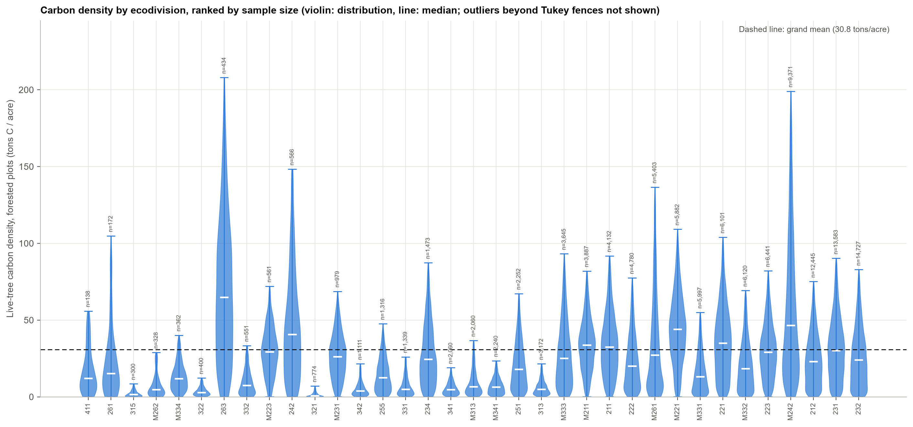

# How Much Carbon Is in an Acre of Forest? It Depends Enormously on Where You Are

*Understanding FIA data, part 3: carbon density by ecoregion*

The first and second posts in this series asked a narrow question: how trustworthy are the tree heights in FIA's database when they weren't actually measured in the field? This post asks something different with the same database — how much live-tree carbon does an acre of forest actually hold, and does that number really differ from one U.S. ecoregion to the next, or could the apparent differences just be noise? Across 125,123 forested plots and 35 Cleland ecodivisions, the answer is yes: carbon density varies 28-fold, from 2.8 to 76.8 tons C/acre, and that difference holds up across four distribution-robust statistical tests. A second question turned out to matter just as much, though: the uncertainty around each region's estimate is itself unusually large, and tracing why connects directly back to the first two posts — the regions holding the most carbon turn out to be the same ones this series already found lean hardest on modeled, rather than measured, tree heights.

## 1. Introduction

Two preceding posts in this series examined the reliability of tree height measurements in the FIA database when a field measurement was not available: Part 1 compared crew-reconstructed heights on broken-top trees (height method code, HTCD, 2–3) against a regional height-diameter model trained only on field-measured trees (HTCD 1); Part 2 examined FIA's own internally modeled heights (HTCD 4) against the same regional model and against an independent remeasurement-based benchmark. Both posts are available at [pratyush-dh.github.io/projects/blog/](https://pratyush-dh.github.io/projects/blog/) and [pratyush-dh.github.io/projects/blog/htcd4/](https://pratyush-dh.github.io/projects/blog/htcd4/), respectively.

The present analysis addresses a different question using the same database: does live-tree carbon density, as computed by FIA's National Scale Volume and Biomass (NSVB) pipeline, vary meaningfully across ecological regions of the United States, and if so, how precisely can that variation be characterized? This question is relevant to any application that compares carbon density across regions — land management planning, carbon-offset valuation, or benchmarking a given forest stand against regional norms — and it requires two distinct lines of evidence: (1) whether the regional differences in the mean are statistically defensible given the distributional properties of the data, and (2) whether the uncertainty attached to each regional estimate is itself well understood. The second question turns out to connect directly back to the height-measurement issues examined in Parts 1 and 2.

Section 2 describes the data, unit of analysis, and statistical methods. Section 3 presents the omnibus and post-hoc test results, the ranked carbon density estimates, and the investigation into within-division uncertainty. Section 4 discusses the connection to tree-height measurement method. Section 5 states the limitations of the analysis, and Section 6 concludes.

## 2. Data and Methods

### 2.1 Data source and scope

Live-tree carbon density was computed from `TREE.CARBON_AG` and `TREE.CARBON_BG` (FIA's NSVB-derived aboveground and belowground carbon estimates for live trees), summed per plot and converted to tons per acre. This analysis is restricted to **live-tree carbon only**; soil organic carbon, standing and downed dead wood, litter, and understory vegetation carbon are reported by FIA at the condition level but are not included here. Each state's most recent EXPCURR inventory evaluation was used, consistent with the rest of this series; because states reach their most recent evaluation in different years, this reflects each state's own latest cycle rather than a single fixed national year.

Plots were assigned to one of 35 Cleland ecodivisions using a spatial join with the EcoMap division layer. Alaska, Hawaii, and the U.S. territories are excluded, as this layer does not cover them. Of 313,178 plots with an assigned ecodivision, 125,123 are forested (carbon density > 0) and form the analytic sample. One division (code 262, n = 21) falls below a minimum sample size of 100 forested plots and is reported descriptively but excluded from the significance tests.

### 2.2 Unit of analysis and weighting

The unit of analysis is the **forested plot**, not the individual tree: every live tree's carbon value on a plot is weighted by `TPA_UNADJ × ADJ_FACTOR` (micro-plot or subplot adjustment factor, depending on diameter) and summed to a single plot-level density, following the per-plot weighting convention used throughout this project. Aggregating at the plot level prevents within-plot correlation among trees from artificially inflating the effective sample size in the statistical tests below.

FIA's base plot grid is an equal-probability systematic sample, so an unweighted mean across a division's plots is a valid estimator of that division's mean density; the stratum expansion factor (`EXPNS`), which scales a sample to a population *total*, is not required for a density comparison. As a sensitivity check, each division's `EXPNS`-weighted mean was also computed and agrees with the unweighted mean within 10.5 percentage points in every division, typically substantially closer.

### 2.3 Statistical methods

Plot-level carbon density is strongly right-skewed and markedly heteroscedastic across ecodivisions (standard deviation ranges from 3.6 to 63 tons/acre). A Levene's test (Brown-Forsythe, median-centered) confirmed unequal variances (p < 10⁻³⁰⁰), violating the equal-variance assumption of classical one-way ANOVA. Consequently, four omnibus tests were run in parallel: Welch's ANOVA (the primary test, robust to unequal variances), Kruskal-Wallis (rank-based, distribution-free), classical Fisher ANOVA (reported for comparison only, given the violated assumption), and Welch's ANOVA repeated on log1p-transformed density (as a robustness check on the raw scale's skew).

Pairwise regional comparisons were conducted using two post-hoc procedures appropriate to the primary tests: Games-Howell (paired with Welch's ANOVA; valid under unequal variances and unequal group sizes) and Dunn's test with Holm step-down correction (paired with Kruskal-Wallis; rank-based, distribution-free), applied across all 595 pairs of the 35 included divisions.

To investigate the precision of division-level estimates (Section 3.4), the same 125,123 forested plots were independently regrouped by U.S. state, and the coefficient of variation (CV = SD/mean) was computed for each grouping. A two-sample Mann-Whitney U test compared the distribution of division-level CVs (n = 35) against the distribution of state-level CVs (n = 48 states with ≥ 100 forested plots). The relationship between CV and sample size was further characterized via the Pearson correlation between CV and log(n).

## 3. Results

### 3.1 Omnibus tests

All four omnibus tests reject the null hypothesis of no difference in mean carbon density across ecodivisions, and they agree closely in effect size (Table 1).

**Table 1.** Omnibus test results for carbon density by ecodivision.

| Test | Assumption | Result |
|---|---|---|
| Levene's (Brown–Forsythe) | — (tests equal variance) | Rejected: variances differ sharply by division |
| Welch's ANOVA (primary) | Unequal variances allowed | F(34, 9917) = 2075, p < 10⁻³⁰⁰, partial η² = 0.219 |
| Kruskal–Wallis | No distributional assumption | H(34) = 29,479, p < 10⁻³⁰⁰, ε² = 0.235 |
| Classical (Fisher) ANOVA | Equal variances (violated) | F(34, 125067) = 1034, p < 10⁻³⁰⁰, η² = 0.219 — comparison only |
| Welch's ANOVA, log1p scale | Robust to raw-scale skew | F = 1395, p < 10⁻³⁰⁰, partial η² = 0.242 |

Ecodivision accounts for approximately one-fifth of total plot-to-plot variance in carbon density (partial η² ≈ 0.22), a large effect by conventional standards (Cohen, 1988), and the conclusion is invariant to distributional assumptions, transformation, or the equal-variance violation.

Figure 1 displays the full distribution by division.

### 3.2 Post-hoc pairwise comparisons

Of 595 pairwise division comparisons, 540 (90.8%) are significant at p < 0.05 under Games-Howell correction, and 530 (89.1%) under Dunn-Holm correction — close agreement between a parametric and a rank-based procedure. The minority of non-significant pairs are predominantly adjacent divisions in the overall ranking, or involve the division with the smallest tested sample (n = 172).

### 3.3 Mean carbon density by ecodivision

Mean carbon density ranges from 2.8 tons/acre (division 321, Tropical/Subtropical Steppe) to 76.8 tons/acre (division 263, Mediterranean climate, central California coast) — a 28-fold range. The spatial pattern (Figure 2) follows established forest-carbon geography: Pacific coast conifer forest and the Appalachian/Northeastern divisions carry the highest density; semi-arid divisions of the Southwest and southern Plains carry the lowest. Table 2 reports the full ranked estimates with 95% confidence intervals.

**Table 2.** Ranked mean carbon density by ecodivision with 95% confidence intervals (highest to lowest). Divisions above the line met the minimum-sample-size criterion for inclusion in the significance tests (n ≥ 100); division 262 is reported separately below the line.

| Division | Name | n plots | Mean (tons C/acre) | 95% CI |
|---|---|---|---|---|
| 263 | Mediterranean | 434 | 76.8 | 70.9–82.8 |
| M242 | Marine | 9,371 | 64.2 | 63.1–65.4 |
| 242 | Marine | 566 | 51.5 | 48.0–55.1 |
| M221 | Hot Continental | 5,882 | 45.9 | 45.3–46.6 |
| M261 | Mediterranean | 5,403 | 43.0 | 41.8–44.2 |
| 261 | Mediterranean | 172 | 40.9 | 33.2–48.6 |
| 221 | Hot Continental | 6,101 | 37.7 | 37.1–38.4 |
| M211 | Warm Continental | 3,887 | 35.3 | 34.7–35.8 |
| 211 | Warm Continental | 4,132 | 35.0 | 34.3–35.6 |
| 231 | Subtropical | 13,583 | 33.0 | 32.7–33.4 |
| 223 | Hot Continental | 6,441 | 32.1 | 31.6–32.6 |
| M333 | Temperate Desert | 3,645 | 31.1 | 30.3–31.9 |
| M223 | Hot Continental | 561 | 30.4 | 29.1–31.8 |
| 234 | Subtropical | 1,473 | 29.4 | 28.3–30.5 |
| 232 | Subtropical | 14,727 | 28.2 | 27.8–28.5 |
| M231 | Subtropical | 979 | 27.8 | 26.8–28.8 |
| 212 | Warm Continental | 12,445 | 26.1 | 25.8–26.5 |
| 222 | Hot Continental | 4,780 | 25.5 | 24.9–26.1 |
| M332 | Temperate Desert | 6,120 | 23.6 | 23.1–24.1 |
| 251 | Prairie | 2,252 | 22.1 | 21.4–22.8 |
| 411 | Savannah | 138 | 19.8 | 16.7–22.9 |
| M331 | Temperate Desert | 5,997 | 17.5 | 17.1–17.9 |
| 255 | Prairie | 1,316 | 15.5 | 14.8–16.1 |
| M334 | Temperate Desert | 362 | 14.5 | 13.4–15.6 |
| M313 | Tropical/Subtropical Steppe | 2,060 | 12.3 | 11.7–12.9 |
| 332 | Temperate Steppe | 551 | 11.8 | 10.7–12.9 |
| M262 | Mediterranean | 328 | 10.2 | 8.9–11.5 |
| 331 | Temperate Steppe | 1,339 | 9.0 | 8.4–9.5 |
| M341 | Temperate Desert | 2,240 | 8.6 | 8.3–9.0 |
| 342 | Temperate Desert | 1,111 | 8.4 | 7.8–9.0 |
| 313 | Tropical/Subtropical Steppe | 3,172 | 8.4 | 8.0–8.7 |
| 341 | Temperate Desert | 2,060 | 7.1 | 6.8–7.5 |
| 322 | Tropical/Subtropical Desert | 400 | 4.7 | 4.2–5.2 |
| 315 | Tropical/Subtropical Steppe | 300 | 2.8 | 2.4–3.2 |
| 321 | Tropical/Subtropical Steppe | 774 | 2.8 | 2.4–3.2 |
| *262* | *Mediterranean* | *21* | *13.3* | *6.6–20.0 (n below inclusion threshold)* |

The 95% confidence intervals in Table 2 are plot-level intervals (mean ± 1.96 × SE, computed from the raw plot-to-plot standard deviation and count), not FIA's full post-stratified design-based variance estimator. This is an appropriate basis for comparing density across groupings but does not capture every source of uncertainty FIA's own published population estimates would include — a point developed further in Section 3.4.

### 3.4 Within-division variability and its relationship to sample design

In addition to testing whether division means differ, the precision of each division's estimate was examined directly. Division-level coefficients of variation (CV = SD/mean) average approximately 0.7–0.9 (Figure 3), which is high relative to typical reporting expectations for a national forest inventory.

Two explanations were evaluated. First, whether CV is primarily driven by sample size: a modest negative correlation exists between CV and log(n) (Pearson r = -0.40, p = 0.017; Figure 4), but the relationship is loose — division 321 (n = 774, a mid-range sample) exhibits the highest CV in the dataset (2.10), well above the value predicted by the fitted trend.

Second, whether CV is elevated specifically as an artifact of aggregating at the ecodivision level. FIA's plot grid and stratification are designed to support **state- and national-level** estimation; ecodivisions are climate and physiographic boundaries that cut across state and stratum lines and were not a target of the original sample allocation. Regrouping the identical 125,123 forested plots by state instead of by ecodivision provides a direct test of this hypothesis (Figure 5).

Median CV is 0.84 at the ecodivision level versus 0.69 at the state level, a statistically significant difference (Mann-Whitney U, p = 0.015). This difference is not attributable to sample size: median plot count per group is comparable between the two groupings (2,060 plots/division vs. 2,702 plots/state). These results are consistent with the sampling-design explanation: state-level aggregation groups plots according to the structure the inventory was designed to support, whereas ecodivision-level aggregation groups them by an independent criterion (climate and vegetation zone) that concentrates, rather than averages out, plot-to-plot heterogeneity within each group. This finding indicates that ecoregion-level carbon density estimates carry structurally higher uncertainty than a state-level estimate of comparable sample size, independent of whether the underlying forest characteristics in any particular division are accurately represented.

## 4. Discussion

### 4.1 Connection to tree-height measurement method

The ecodivisions with the highest carbon density in this analysis are not randomly distributed with respect to the tree-height measurement issues examined in Parts 1 and 2 of this series. To characterize this relationship, the carbon total for each of the twelve highest-density divisions was decomposed by the height-measurement method of the contributing trees: field-measured (HTCD 1), crew-estimated (HTCD 2–3, Part 1), or FIA-modeled (HTCD 4, Part 2).

Division 263, the single highest-carbon division in this analysis (76.8 tons/acre), derives 48.6% of its carbon from trees with a field-measured height and 43.2% from FIA's HTCD 4 model. Division M242 (Marine, the largest division by sample size at n = 9,371, and the region shown in Part 2 to contain 99.3% of the nation's HTCD 4 trees) derives 23% of its carbon from modeled heights. By contrast, the Appalachian and eastern "Hot/Warm Continental" divisions that complete the top twelve by carbon density (221, M211, 211) derive 84.2–92.2% of their carbon from field-measured trees and essentially none (0.00–0.08%) from FIA's model; the non-field-measured remainder in these divisions is a crew visual estimate rather than a model-based imputation.

This pattern does not indicate that carbon estimates for the Pacific coast and Mediterranean-climate divisions are inaccurate: Part 2 found that FIA's modeled heights agree closely with an independently fitted regional model, and the broader study underlying this series found that substituting modeled heights for an independent model shifts national volume and biomass totals by well under half a percent. Rather, it identifies a second, independent reason — alongside the sampling-design finding in Section 3.4 — that the confidence intervals in Table 2 understate total uncertainty for the highest-carbon divisions specifically: those intervals reflect only plot-to-plot sampling variation and include no allowance for uncertainty in the underlying height estimates. The divisions carrying the most carbon are disproportionately both (a) the divisions with the least favorable sampling-design properties for ecoregion-level aggregation, and (b) the divisions most dependent on modeled rather than measured height inputs.

### 4.2 Implications

For applications that condition decisions on regional carbon density estimates — land management, carbon-offset markets, or comparative benchmarking — these results suggest that uncertainty bands derived solely from plot-level sampling variance will understate the true uncertainty for high-carbon, Pacific-coast and Mediterranean-climate divisions. A more complete uncertainty accounting for these regions would incorporate both the structurally wider sampling uncertainty documented in Section 3.4 and the height-imputation uncertainty documented in Section 4.1.

## 5. Limitations

1. **Scope.** This analysis is restricted to live-tree carbon (`CARBON_AG` + `CARBON_BG`). Soil organic carbon, standing and downed dead wood, litter, and understory vegetation carbon are excluded, though FIA reports all of these at the condition level.
2. **Non-contemporaneous evaluation years.** Each state's own most recent EXPCURR evaluation cycle was used; this mixes inventory years across states rather than representing a single fixed national year.
3. **Confidence interval basis.** The intervals reported in Table 2 are plot-level (mean ± 1.96 × SE), not derived from FIA's full post-stratified design-based variance estimator used elsewhere in this project for population totals. This choice is appropriate for comparing density across groupings but does not represent a complete uncertainty accounting.
4. **Descriptive, not causal, evidence for the sampling-design explanation.** The ecodivision-versus-state CV comparison (Section 3.4) is a two-sample comparison of group-level CVs, not a formal mixed-effects variance decomposition. It is consistent with, and is the most parsimonious explanation for, the observed difference, but it cannot fully exclude the alternative that ecoregions are intrinsically more heterogeneous than states as a matter of geography, independent of sample design.
5. **Map generalization.** Division boundaries are drawn from a coarse, generalized EcoMap layer; division labels are placed at each polygon's representative point. Fine-scale within-division variation is not resolved at this scale.
6. This is an independent analysis and has not undergone formal peer review.

## 6. Conclusion

Live-tree carbon density differs substantially and statistically significantly across U.S. ecodivisions (28-fold range; partial η² ≈ 0.22 across four convergent omnibus tests), confirming that ecoregion is a meaningful grouping variable for carbon density. However, the precision with which any single ecodivision's carbon density can be stated is lower than it would be for a comparably sized state-level estimate, for two largely independent reasons: FIA's sampling design was not optimized for ecoregion-level aggregation (Section 3.4), and the highest-carbon divisions are disproportionately dependent on modeled rather than measured tree-height inputs (Section 4.1). Both sources of additional uncertainty concentrate in the same set of divisions — the Pacific coast and Mediterranean-climate regions — which are also the divisions holding the most carbon. Quantifying these two sources of uncertainty explicitly, rather than relying on plot-sampling standard errors alone, is a direct and tractable extension of this work.

## Data and Code Availability

This analysis builds on [Part 1](https://pratyush-dh.github.io/projects/blog/) and [Part 2](https://pratyush-dh.github.io/projects/blog/htcd4/) of this series, which provide background on HTCD and the regional height-diameter model referenced in Section 4.1. Scripts, full result tables (all omnibus and pairwise test statistics, the state-level CV comparison, and the division-by-HTCD carbon decomposition), and print-quality figures are available at [`carbon_ecoregion`](https://github.com/pratyush-dh/projects/tree/main/blog/carbon_ecoregion). All analyses read the public FIADB SQLite export directly; no database server is required to reproduce them.

## References

Cohen, J. (1988). *Statistical Power Analysis for the Behavioral Sciences* (2nd ed.). Lawrence Erlbaum Associates.

This is an independent analysis and not an official FIA product. Corrections and questions are welcome via [GitHub issue](https://github.com/pratyush-dh/projects/issues).
