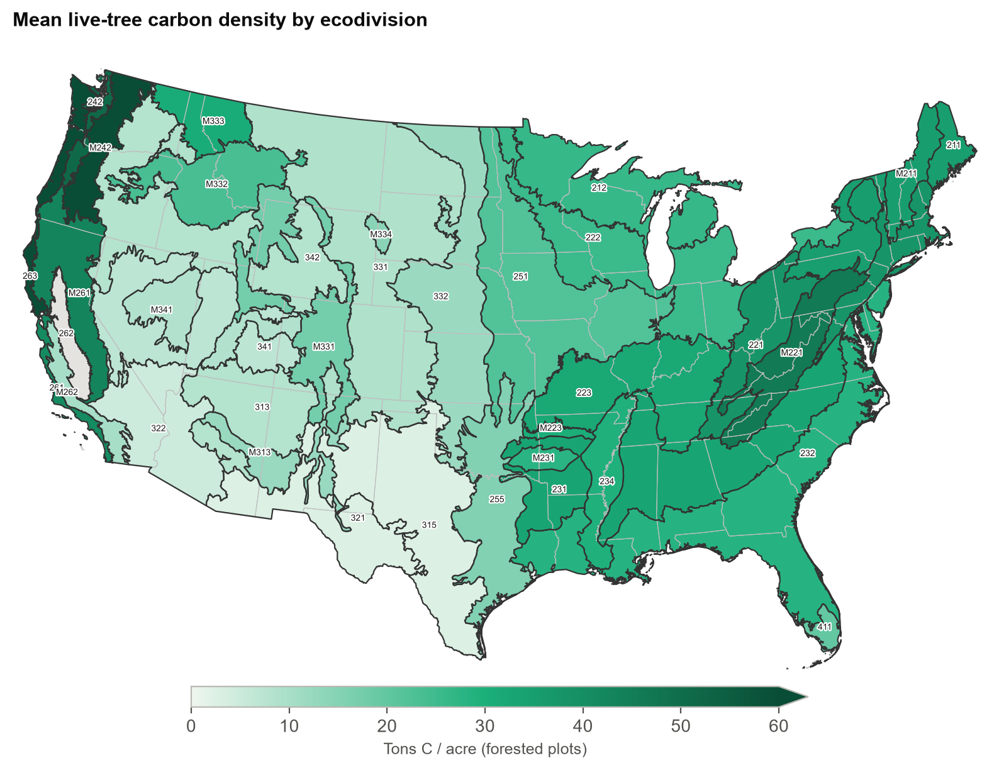
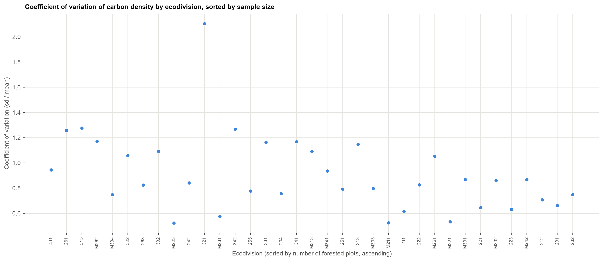
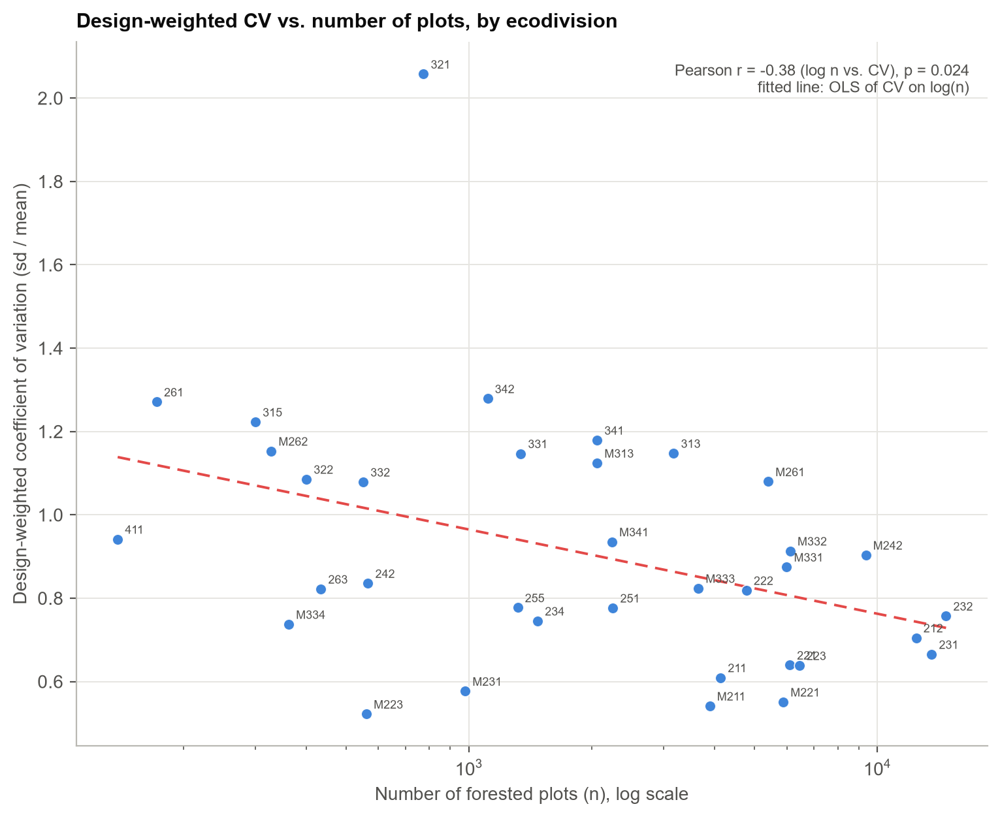
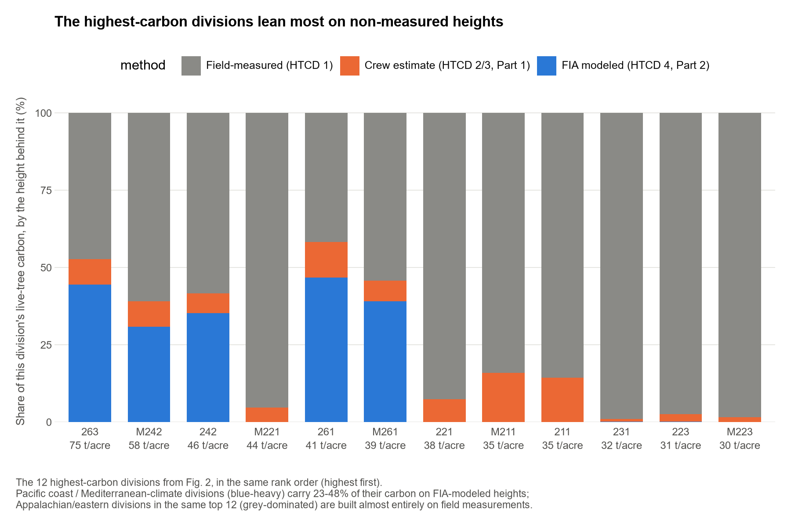

# How Much Carbon Is in an Acre of Forest? It Depends Enormously on Where You Are

*Understanding FIA data, part 3: carbon density by ecoregion*

The [first](https://pratyush-dh.github.io/projects/blog/) and [second](https://pratyush-dh.github.io/projects/blog/htcd4/) posts in this series asked a narrow question: how trustworthy are the tree heights in FIA's database when they weren't actually measured in the field? This post asks something different with the same database. How much live-tree carbon does an acre of forest actually hold, and does that number really differ from one U.S. ecoregion to the next, or could the apparent differences just be noise? Using FIA's own post-stratification weights across 125,123 forested plots and 35 Cleland ecodivisions, the answer is yes. Design-based carbon density varies about 29-fold, from 2.6 to 75.4 tons of carbon per acre, and that difference holds up across four distribution-robust statistical tests. A second question turned out to matter just as much: the spread within each region is unusually large, and tracing why connects back to the first two posts. The regions holding the most carbon are the ones this series already found lean hardest on modeled, rather than measured, tree heights.

Two terms appear throughout. The **coefficient of variation (CV)** is the standard deviation divided by the mean, so it measures spread relative to the average; a CV of 0.8 means a typical plot differs from the average by about 80% of that average. The **design-weighted** version uses FIA's own expansion weights, which say how many acres each plot stands for. A glossary of all technical terms, with links to learn more, is at the end.

## 1. Introduction

Two preceding posts in this series examined the reliability of tree height measurements in the [Forest Inventory and Analysis (FIA)](https://www.fia.fs.usda.gov/tools-data/) database when a field measurement was not available. [Part 1](https://pratyush-dh.github.io/projects/blog/) compared crew-reconstructed heights on broken-top trees (height method code, HTCD, 2–3) against a regional height-diameter model trained only on field-measured trees (HTCD 1). [Part 2](https://pratyush-dh.github.io/projects/blog/htcd4/) examined FIA's own internally modeled heights (HTCD 4) against the same regional model and against an independent remeasurement-based benchmark.

The present analysis addresses a different question using the same database. Does live-tree carbon density, as computed by FIA's [National Scale Volume and Biomass (NSVB)](https://research.fs.usda.gov/programs/fia/nsvb) pipeline, vary meaningfully across ecological regions of the United States, and if so, how precisely can that variation be characterized? This matters for any application that compares carbon density across regions, such as land management planning, carbon-offset valuation, or benchmarking a forest stand against regional norms. It requires two lines of evidence: (1) whether the regional differences in the mean are statistically defensible given the distributional properties of the data, and (2) whether the uncertainty attached to each regional estimate is itself well understood. The second question connects directly back to the height-measurement issues examined in Parts 1 and 2.

Section 2 describes the data, unit of analysis, and estimation methods. Section 3 presents the results: the distributional and test results, the design-based estimates by ecodivision, the spread analysis, and the aggregation checks. Section 4 discusses the connection to tree-height measurement method. Section 5 states the limitations, Section 6 concludes, and a glossary follows.

## 2. Data and Methods

### 2.1 Data source and scope

Carbon density was computed from `TREE.CARBON_AG` and `TREE.CARBON_BG`, FIA's aboveground and belowground carbon estimates for live trees, summed per plot and converted to tons per acre. The analysis is restricted to **live-tree carbon only**. Soil organic carbon, standing and downed dead wood, litter, and understory vegetation carbon are reported by FIA at the condition level but are not included. Each state's most recent current-inventory evaluation (EXPCURR) was used. Because states reach their latest evaluation in different years, the national figures combine each state's own latest cycle rather than one fixed year. The public data are the [FIADB database](https://www.fia.fs.usda.gov/tools-data/), and national and state estimates can be reproduced with FIA's [EVALIDator tool](https://www.fia.fs.usda.gov/tools-data/).

Plots were assigned to one of 35 Cleland ecodivisions (Cleland et al., 2007) by spatial overlap with the ecodivision layer. Of 334,046 plots on the latest evaluations, 313,178 fall inside an ecodivision. Of those, 125,123 are forested (live-tree carbon greater than zero), which is the analytic sample for the ecodivision estimates. Another 3,666 forested plots lie outside any division (Alaska, Hawaii, Pacific island inventories, and plots inside the layer's water polygons); they are included in the national totals but not in the ecodivision tables. One division (code 262, n = 21) falls below a minimum of 100 forested plots and is reported descriptively only.

### 2.2 Design-based estimation

FIA samples the country with a systematic grid of plots. The plots are grouped into **strata** (groups sampled with the same intensity), and each stratum carries an **expansion factor** that says how many acres each of its plots represents. Summing expanded plot values gives estimates for whole states and the nation. This is FIA's **post-stratified** design (Bechtold and Patterson, 2005; Scott et al., 2005), and the estimators below follow the convention the project already uses for national and state totals.

The notation is defined in Table A. Plots are indexed by \(j\) and strata by \(h\).

**Table A.** Notation used in the estimates.

| Symbol | Meaning |
|---|---|
| \(j\), \(h\) | Plot index and stratum index |
| \(n_h\), \(n\) | Number of plots in stratum \(h\); total plots, \(n = \sum_h n_h\) |
| \(\mathrm{EXPNS}_h\) | Expansion factor: acres each plot in stratum \(h\) represents |
| \(A\) | Total acres represented by the sample, \(A = \sum_h \mathrm{EXPNS}_h\, n_h\) |
| \(W_h\) | Share of total area in stratum \(h\), \(W_h = \mathrm{EXPNS}_h\, n_h / A\) |
| \(y_j\) | Live-tree carbon on plot \(j\), in tons C per acre of plot |
| \(x_j\) | Forest indicator: 1 if plot \(j\) is forested (carbon greater than 0), otherwise 0 |
| \(s_h^2\) | Variance of plot values \(y_j\) within stratum \(h\) |
| \(\hat{Y}\), \(\hat{X}\) | Estimated total carbon (tons C) and estimated forested acres |
| \(R\) | Mean carbon per forested acre, \(R = \hat{Y} / \hat{X}\) |
| \(\bar{y}_w\), \(s_w\) | Design-weighted mean and standard deviation of plot values |
| wCV | Design-weighted coefficient of variation, \(s_w / \bar{y}_w\) |

The estimated total carbon is

\[
\hat{Y} = \sum_{h} \mathrm{EXPNS}_h \sum_{j \in h} y_j ,
\]

and its variance is

\[
V(\hat{Y}) = A^2 \left[ \frac{1}{n} \sum_{h} W_h\, s_h^2 + \frac{1}{n^2} \sum_{h} (1 - W_h)\, s_h^2 \right].
\]

The same estimator applied to the forest indicator gives \(\hat{X}\), the forested acres. The mean carbon per forested acre is the ratio \(R = \hat{Y}/\hat{X}\). Its variance comes from a first-order (delta-method) approximation:

\[
V(R) \approx \frac{V(\hat{Y}) + R^2\, V(\hat{X}) - 2R\, \mathrm{Cov}(\hat{Y}, \hat{X})}{\hat{X}^2}.
\]

A 95% confidence interval is \(R \pm 1.96\sqrt{V(R)}\). Ecodivision estimates use domain indicators: a division's \(\hat{Y}\) and \(\hat{X}\) include only its plots, but the stratum sizes \(n_h\) and expansion factors are those of the full design.

### 2.3 Spread (coefficient of variation)

The spread of plot values is measured by the coefficient of variation, \(\mathrm{CV} = s / \bar{y}\), the standard deviation divided by the mean. The **design-weighted CV (wCV)** weights each forested plot by its expansion factor, so that plots representing more acres count more:

\[
\bar{y}_w = \frac{\sum_j \mathrm{EXPNS}_j\, y_j}{\sum_j \mathrm{EXPNS}_j}, \qquad
s_w = \sqrt{\frac{\sum_j \mathrm{EXPNS}_j\, (y_j - \bar{y}_w)^2}{\sum_j \mathrm{EXPNS}_j}}, \qquad
\mathrm{wCV} = \frac{s_w}{\bar{y}_w},
\]

where the sums run over forested plots (\(x_j = 1\)) in the domain. This is the spread across the forested acres of a domain, not across plots treated equally.

### 2.4 Statistical tests

Plot-level carbon density is strongly right-skewed and its variance differs markedly across ecodivisions, so classical one-way ANOVA is not suitable. A Levene's test (Brown–Forsythe version, Brown and Forsythe, 1974) checks for unequal variances. Four omnibus tests of mean differences were run in parallel: Welch's ANOVA (Welch, 1951), which does not assume equal variances; the Kruskal–Wallis test (Kruskal and Wallis, 1952), which uses ranks; Fisher's classical ANOVA, reported only for comparison; and Welch's ANOVA on log1p-transformed values, a check on the skew. Pairwise differences were assessed with Games–Howell (Games and Howell, 1976) and Dunn's test with Holm correction (Dunn, 1964; Holm, 1979). The omnibus and pairwise tests use unweighted plot values, since they describe distribution shape and separation, while all means, intervals, and spread values reported in the results use design weights.

To compare spread between levels, the division-level and state-level wCV values were compared with a Mann–Whitney U test (Mann and Whitney, 1947), and the relationship between CV and plot count was described with a Pearson correlation on log(n).

### 2.5 Checks on FIA's aggregation

Because the design estimates are built plot by plot, the state totals, the ecodivision totals, and the national total should match exactly. This was tested directly. A second check recomputed the national total separately for aboveground and belowground carbon, and compared the aboveground figure to a published national value.

## 3. Results

### 3.1 Distributions and omnibus tests

Plot-level carbon density differs across ecodivisions in both level and spread (Figure 1). Table 1 reports all four omnibus tests on unweighted plot values. Levene's test rejects equal variances, and each of the four omnibus tests of means rejects equal means across ecodivisions, with effect sizes that agree. Ecodivision accounts for about one-fifth of total plot-to-plot variance (partial η² ≈ 0.22), which is large by conventional standards (Cohen, 1988), and the conclusion does not depend on the distributional assumptions.

**Table 1.** Omnibus tests of carbon density across ecodivisions (unweighted plot values).

| Test | Assumption | Result |
|---|---|---|
| Levene's (Brown–Forsythe) | — (tests equal variance) | Rejected: variances differ sharply by division |
| Welch's ANOVA (primary) | Unequal variances allowed | F(34, 9917) = 2075, p < 10⁻³⁰⁰, partial η² = 0.219 |
| Kruskal–Wallis | No distributional assumption | H(34) = 29,479, p < 10⁻³⁰⁰, ε² = 0.235 |
| Classical (Fisher) ANOVA | Equal variances (violated) | F(34, 125067) = 1034, p < 10⁻³⁰⁰, η² = 0.219 — comparison only |
| Welch's ANOVA, log1p scale | Robust to raw-scale skew | F = 1395, p < 10⁻³⁰⁰, partial η² = 0.242 |

Of the 595 pairs of divisions, 540 (90.8%) differ at p < 0.05 under Games–Howell correction, and 530 (89.1%) under Dunn–Holm correction. The two procedures agree closely. The few non-significant pairs are mostly neighbors in the ranking or involve division 261, which has the smallest sample tested (172 plots).

### 3.2 Design-based carbon density by ecodivision

With FIA's expansion weights, mean carbon density ranges from 2.6 tons C per forested acre in division 321 (Tropical/Subtropical Steppe) to 75.4 tons in division 263 (Mediterranean, central California coast), a spread of about 29-fold. Figure 2 maps the design-based means. Pacific coast conifer forest and the Appalachian and Northeastern divisions carry the highest density; semi-arid divisions in the Southwest and southern Plains carry the lowest.

Table 2 gives the design-based estimates with 95% confidence intervals and the design-weighted spread (wCV) for each division. The 35 divisions above the line met the 100-plot threshold for inclusion in the tests. Division 262 is shown below the line for completeness.

**Table 2.** Design-based mean live-tree carbon density by ecodivision (tons C per forested acre), ranked highest to lowest, with 95% confidence intervals and design-weighted spread (wCV).

| Division | Name | Forested plots (n) | Mean (tons C per forested acre) | 95% CI | Spread (wCV) |
|---|---|---|---|---|---|
| 263 | Mediterranean | 434 | 75.4 | 69.9–80.9 | 0.82 |
| M242 | Marine | 9,371 | 58.4 | 57.4–59.4 | 0.90 |
| 242 | Marine | 566 | 46.1 | 43.1–49.2 | 0.84 |
| M221 | Hot Continental | 5,882 | 43.5 | 42.9–44.1 | 0.55 |
| 261 | Mediterranean | 172 | 40.8 | 33.5–48.2 | 1.27 |
| M261 | Mediterranean | 5,403 | 39.0 | 38.1–40.0 | 1.08 |
| 221 | Hot Continental | 6,101 | 37.8 | 37.3–38.4 | 0.64 |
| M211 | Warm Continental | 3,887 | 34.9 | 34.3–35.4 | 0.54 |
| 211 | Warm Continental | 4,132 | 34.7 | 34.1–35.3 | 0.61 |
| 231 | Subtropical | 13,583 | 32.4 | 32.1–32.8 | 0.67 |
| 223 | Hot Continental | 6,441 | 31.3 | 30.8–31.7 | 0.64 |
| M223 | Hot Continental | 561 | 30.4 | 29.1–31.6 | 0.52 |
| M333 | Temperate Desert | 3,645 | 30.0 | 29.3–30.8 | 0.82 |
| 234 | Subtropical | 1,473 | 29.3 | 28.3–30.4 | 0.75 |
| M231 | Subtropical | 979 | 27.7 | 26.8–28.6 | 0.58 |
| 232 | Subtropical | 14,727 | 27.6 | 27.3–27.9 | 0.76 |
| 222 | Hot Continental | 4,780 | 27.5 | 26.8–28.1 | 0.82 |
| 212 | Warm Continental | 12,445 | 26.1 | 25.7–26.4 | 0.70 |
| 251 | Prairie | 2,252 | 22.8 | 22.1–23.5 | 0.78 |
| M332 | Temperate Desert | 6,120 | 21.9 | 21.4–22.4 | 0.91 |
| 411 | Savannah | 138 | 19.7 | 17.1–22.3 | 0.94 |
| M331 | Temperate Desert | 5,997 | 17.3 | 16.9–17.6 | 0.87 |
| 255 | Prairie | 1,316 | 15.6 | 15.0–16.2 | 0.78 |
| M334 | Temperate Desert | 362 | 14.6 | 13.6–15.6 | 0.74 |
| 332 | Temperate Steppe | 551 | 12.0 | 11.0–13.0 | 1.08 |
| M313 | Tropical/Subtropical Steppe | 2,060 | 11.6 | 11.1–12.1 | 1.12 |
| M262 | Mediterranean | 328 | 10.2 | 9.0–11.4 | 1.15 |
| 331 | Temperate Steppe | 1,339 | 8.8 | 8.3–9.3 | 1.15 |
| M341 | Temperate Desert | 2,240 | 8.6 | 8.3–9.0 | 0.94 |
| 342 | Temperate Desert | 1,111 | 8.4 | 7.8–8.9 | 1.28 |
| 313 | Tropical/Subtropical Steppe | 3,172 | 8.2 | 7.9–8.5 | 1.15 |
| 341 | Temperate Desert | 2,060 | 7.3 | 6.9–7.6 | 1.18 |
| 322 | Tropical/Subtropical Desert | 400 | 4.6 | 4.1–5.0 | 1.09 |
| 315 | Tropical/Subtropical Steppe | 300 | 2.7 | 2.4–3.0 | 1.22 |
| 321 | Tropical/Subtropical Steppe | 774 | 2.6 | 2.2–2.9 | 2.06 |
| *262* | *Mediterranean* | *21* | *13.0* | *6.9–19.1* | *1.13* |

Design weighting changes several means, and the change is informative. Division M242 (Marine) falls from 64.2 tons per acre when plots are averaged equally to 58.4 when each plot is weighted by the acres it represents. Division 242 (Marine) falls from 51.5 to 46.1, a 10.5% change, and division 263 from 76.8 to 75.4. The unweighted values in the earlier version of this post are superseded by Table 2. The reason is that FIA samples some strata more intensively than others. Equal-weight averages over-represent the more intensively sampled strata, and the expansion factors correct for that. Design-based values are the right basis for comparing regions.

### 3.3 Spread within ecodivisions

Design-weighted spread is high across ecodivisions. The median wCV is 0.84, with values from 0.52 (division M223) to 2.06 (division 321, Tropical/Subtropical Steppe). Figure 3 shows the wCV for each division in order of increasing plot count.

Does more sampling reduce the spread? Partly. There is a modest negative correlation between wCV and log plot count (Pearson r = −0.38, p = 0.024; Spearman ρ = −0.43, p = 0.010), shown in Figure 4. The relationship is loose: division 321 has by far the highest CV despite a middling plot count (774), well above the fitted trend.

### 3.4 Ecodivisions versus states

The spread question has a sharper test. The same forested plots can be grouped by ecodivision (35 groups) or by state (48 states with at least 100 forested plots). A spread that is high only because ecodivisions are an awkward grouping should be lower when the plots are grouped by state, the level FIA was designed to estimate. It is. The median design-weighted CV is 0.84 for ecodivisions and 0.70 for states (Mann–Whitney p = 0.013; Figure 5). With unweighted values the medians are 0.84 and 0.69 (p = 0.015), so design weighting does not change the conclusion.

The difference is not explained by sample size. Median plot counts are similar (2,060 per division and 2,702 per state). The most consistent reading is the one suggested by the design. FIA's plot grid and strata are built to produce estimates for states and the nation. Ecodivisions are climate and physiographic regions that cut across state and stratum lines, so each ecodivision mixes plots from several sampling strata and collects more plot-to-plot variation. A narrower CV at the state level therefore reflects how the sample was designed, not necessarily less variability in the forest.

### 3.5 National aggregation and comparison with published totals

Summing the design-based estimates reproduces the national total exactly, as Table 3 shows. The 58 state units, the 35 ecodivisions plus the non-division domain, and an independent aboveground-plus-belowground recomputation all agree to within rounding. The national total is 20,446 million tons of carbon (standard error 44 million tons, 0.2% of the total). Across 706.7 million forested acres, the national mean is 28.9 tons per acre (95% CI 28.8–29.1). The conterminous United States alone accounts for 19,822 million tons over 689.7 million acres, or 28.7 tons per acre.

**Table 3.** Aggregation checks and national totals (live-tree carbon, million short tons C unless noted).

| Check | Value | Result |
|---|---|---|
| Sum of 58 state units | 20,445.8 | Reference total |
| Sum of 35 ecodivisions + non-division domain | 20,445.8 | Matches to rounding (difference 4 × 10⁻⁶) |
| Independent aboveground + belowground recomputation | 20,445.8 | Matches |
| Ecodivisions only (excluding non-division domain) | 19,752.3 | 96.6% of total |
| Non-division domain (Alaska, Hawaii, Pacific islands, plots in water polygons) | 693.5 | Included in national total |
| National total standard error | 43.8 | 0.2% of total |
| National mean (tons C per forested acre) | 28.9 (95% CI 28.8–29.1) | Forested area 706.7 million acres |
| Conterminous US (48 units) | 19,822.4 | 689.7 million forested acres; 28.7 tons per acre |
| Aboveground live-tree carbon, all units | 17,133.8 short tons = 15,543.5 million metric t | Published reference 14,312 million metric t; difference +8.6% |
| Belowground live-tree carbon, all units | 3,312.0 | 16.2% of aboveground-plus-belowground total |

The aboveground comparison is not like-for-like. The published reference is an undated U.S. Forest Service figure (U.S. Forest Service, undated) that predates or differs in method and evaluation years from the current NSVB estimates, and no year-matched official EVALIDator carbon total for this set of evaluations was retrievable. The 8.6% difference should therefore be read as a discrepancy to investigate, not as an error in either figure.

### 3.6 Connection to tree-height measurement method

The ecodivisions with the highest carbon density are not randomly distributed with respect to the height issues in Parts 1 and 2. To check this, each division's carbon was split by the height method of the trees carrying it: field-measured (HTCD 1), crew-estimated (HTCD 2/3, Part 1), or FIA-modeled (HTCD 4, Part 2). Shares use the same design weights.

The pattern is clear. In division 263, the highest-density division at 75.4 tons per acre, 47.3% of carbon comes from field-measured trees, 8.2% from crew estimates, and 44.5% from FIA's model. Division 261 (Mediterranean) is 41.7%, 11.5%, and 46.8%. Division M242 (Marine, 9,371 plots) is 60.9%, 8.3%, and 30.9%, and Division 242 (Marine) is 58.3%, 6.4%, and 35.3%. Part 2 reported that California, Oregon, and Washington hold 99.3% of the nation's HTCD 4 trees; the carbon shares above show how much of that modeled height reaches carbon totals in the highest-density divisions.

By contrast, the Appalachian and eastern Hot and Warm Continental divisions in the top twelve are almost entirely field-measured or crew-estimated. Division 221 is 92.5% field-measured, 7.4% crew-estimated, and 0.07% modeled. Division M211 is 84.1%, 16.0%, and 0.00%, and division 211 is 85.7%, 14.3%, and 0.00%.

## 4. Discussion

### 4.1 Ecodivision spread and FIA's sampling design

The regional differences in mean carbon density are real. Four tests on two scales agree, and the design-based means preserve the 29-fold range. The spread within divisions is a different matter. The spread is higher at the ecodivision scale than at the state scale for the same forested plots (Section 3.4), which suggests that the uncertainty of an ecodivision estimate is set partly by how the sample was designed. FIA's plot grid is built for state and national estimates, and an ecodivision is a regrouping of that sample that the design did not target.

### 4.2 Height-measurement method

The divisions with the most carbon also depend most on modeled heights. Part 2 showed that FIA's modeled heights are close to an independently fitted regional model, and the broader study behind this series found that substituting modeled heights for an independent model changes national volume and biomass totals by well under half a percent. The carbon results here therefore do not indicate that the Pacific coast or Mediterranean carbon totals are wrong. They indicate that the reported confidence intervals (Table 2) reflect only plot-to-plot sampling variation. They contain no allowance for uncertainty in the height inputs, which is largest exactly where the most carbon sits.

### 4.3 Implications

For decisions that depend on regional carbon, such as land management, carbon-offset accounting, or benchmarking a stand against its region, the intervals in Table 2 are a lower bound on uncertainty. A fuller interval would add both the design-level spread in Section 3.4 and the height-method uncertainty in Section 4.2. For the Pacific coast and Mediterranean divisions in particular, that addition would be largest.

## 5. Limitations

1. **Scope.** Only live-tree carbon is analyzed. Soil organic carbon, dead wood, litter, and understory carbon are excluded, even though FIA reports them.
2. **Evaluation years.** Each state uses its own latest evaluation, so national totals mix inventory years.
3. **Sampling error only.** The standard errors and intervals cover plot sampling. They omit NSVB equation error and height-imputation uncertainty.
4. **Variance approximation.** Ratio variances use a first-order delta approximation. Strata with fewer than two plots contribute no within-stratum variance, so their variances are slightly understated.
5. **Unweighted tests.** The omnibus and pairwise tests use plot values rather than expansion-weighted values. They test distribution shape and separation. The design-based estimates in Tables 2 and 3 are the basis for the means and spreads.
6. **Coordinates and boundaries.** Plot coordinates are approximate for privacy, and division membership depends on the Cleland layer's generalized boundaries. Plots in water polygons (162 forested) were treated as non-division. Fine-scale variation within a division is not resolved.
7. **Benchmark.** The published aboveground reference (14,312 million metric t) is undated and not like-for-like, as explained in Section 3.5.
8. **Independence.** The estimator treats the state estimation units as independent when summing variances, the same convention used elsewhere in this project.
9. This is an independent analysis. It has not undergone formal peer review.

## 6. Conclusion

Design-based live-tree carbon density differs substantially across ecodivisions, by about 29-fold, and the difference is robust to the statistical tests used. The national totals add up exactly from states or ecodivisions, and the aboveground comparison with a published figure shows a discrepancy of 8.6% that needs a year-matched benchmark to resolve. Two results add uncertainty beyond sampling error. Ecodivision-level spreads are structurally higher than state-level spreads, consistent with FIA's design, and the regions with the most carbon rely most heavily on modeled tree heights. Both point to the same places, the Pacific coast and Mediterranean-climate divisions. Those regions should carry wider uncertainty bands than their plot-level intervals show, and building those bands is a concrete next step.

## Glossary

| Term | Meaning | Learn more |
|---|---|---|
| Live-tree carbon | Carbon held in living trees, aboveground (`CARBON_AG`) plus belowground roots (`CARBON_BG`), estimated by FIA's NSVB equations. | [NSVB](https://research.fs.usda.gov/programs/fia/nsvb) |
| FIADB | The FIA database: plot, tree, and condition records for all sampled forest land in the United States. | [FIA tools and data](https://www.fia.fs.usda.gov/tools-data/) |
| EVALIDator | FIA's online tool that reproduces official population estimates from FIADB. | [FIA tools and data](https://www.fia.fs.usda.gov/tools-data/) |
| EXPCURR / evaluation | The current inventory evaluation for a state. Each state's latest one is used here. | [FIA tools and data](https://www.fia.fs.usda.gov/tools-data/) |
| Plot | One FIA sample location, about 1/6 acre of forest measured within a cluster of subplots. | [FIA plot design](https://www.fia.fs.usda.gov/tools-data/) |
| Stratum | A group of plots sampled with the same intensity; each stratum has its own expansion factor. | Bechtold and Patterson (2005) |
| Expansion factor (`EXPNS`) | Acres of land each plot represents in its stratum. | Bechtold and Patterson (2005) |
| Post-stratification | Estimating from plots after they are grouped by stratum, using the stratum expansion factors. | Scott et al. (2005) |
| Ecodivision | A Cleland ecological division: a climate and physiographic region of the United States. | Cleland et al. (2007) |
| HTCD | FIA's height method code. 1 = measured; 2/3 = crew estimate; 4 = FIA model. | [Part 1](https://pratyush-dh.github.io/projects/blog/) and [Part 2](https://pratyush-dh.github.io/projects/blog/htcd4/) |
| Mean density (tons C per forested acre) | Carbon divided by forested area, the ratio estimate used for each domain. | Section 2.2 |
| Standard error (SE) | The estimated standard deviation of an estimate across repeated samples. The 95% interval is the estimate ± 1.96 SE. | Any introductory statistics text |
| Coefficient of variation (CV) | Standard deviation divided by mean. A dimensionless spread measure; 0.8 means the typical deviation is 80% of the average. | [Wikipedia: CV](https://en.wikipedia.org/wiki/Coefficient_of_variation) |
| Design-weighted CV (wCV) | CV with each plot weighted by its expansion factor, so the spread reflects forested acres. | Section 2.3 |
| Levene's test | Tests whether groups have equal variances. | Brown and Forsythe (1974) |
| Welch's ANOVA | One-way ANOVA that allows unequal variances. | Welch (1951) |
| Kruskal–Wallis test | A rank-based test of whether groups differ, without normality assumptions. | Kruskal and Wallis (1952) |
| Games–Howell and Dunn–Holm | Pairwise comparison procedures with correction for multiple tests, paired with Welch and Kruskal–Wallis. | Games and Howell (1976); Dunn (1964); Holm (1979) |
| Partial η² and ε² | Effect size: the share of variance a factor explains, here about one-fifth. | Cohen (1988) |
| Mann–Whitney U test | A rank-based test that two independent samples differ. | Mann and Whitney (1947) |
| log1p | log(1 + x): a transformation for right-skewed values that keeps zeros defined. | — |
| Tukey fences | Outlier limits at 1.5 times the interquartile range beyond the quartiles. | Tukey (1977) |
| Violin plot | A box plot with a density curve, showing the shape of a distribution. | — |

## Data and Code Availability

This analysis builds on [Part 1](https://pratyush-dh.github.io/projects/blog/) and [Part 2](https://pratyush-dh.github.io/projects/blog/htcd4/) of this series. Scripts, the design-based estimates by state and ecodivision, the aggregation checks, the HTCD carbon shares, and the figures are in [`carbon_ecoregion`](https://github.com/pratyush-dh/projects/tree/main/blog/carbon_ecoregion). All analyses read the public [FIADB](https://www.fia.fs.usda.gov/tools-data/) SQLite export directly, and no database server is needed.

## References

Bechtold, W. A., and Patterson, P. L. (eds.) (2005). *The Enhanced Forest Inventory and Analysis Program: National Sampling Design and Estimation Procedures.* USDA Forest Service General Technical Report SRS-80.

Brown, M. B., and Forsythe, A. B. (1974). Robust tests for the equality of variances. *Journal of the American Statistical Association*, 69(346), 364–367.

Cleland, D. T., Freeouf, J. A., Keys, J. E., Nowacki, G. J., Carpenter, C., and McNab, W. H. (2007). *Ecological Subregions: Sections and Subsections for the Conterminous United States.* USDA Forest Service General Technical Report WO-76D.

Cohen, J. (1988). *Statistical Power Analysis for the Behavioral Sciences* (2nd ed.). Lawrence Erlbaum Associates.

Dunn, O. J. (1964). Multiple comparisons using rank sums. *Technometrics*, 6(3), 241–252.

Games, P. A., and Howell, J. F. (1976). Pairwise multiple comparison procedures with unequal n's and/or variances. *Psychological Bulletin*, 83(1), 157–160.

Holm, S. (1979). A simple sequentially rejective multiple test procedure. *Scandinavian Journal of Statistics*, 6(2), 65–70.

Kruskal, W. H., and Wallis, W. A. (1952). Use of ranks in one-criterion variance analysis. *Journal of the American Statistical Association*, 47(260), 583–621.

Mann, H. B., and Whitney, D. R. (1947). On a test of whether one of two random variables is stochastically larger than the other. *Annals of Mathematical Statistics*, 18(1), 50–60.

Scott, C. T., Bechtold, W. A., Reams, G. A., Smith, W. D., Westfall, J. A., Hansen, M. H., and Moisen, G. G. (2005). Sample-based estimators used by the Forest Inventory and Analysis national information management system. In: Bechtold and Patterson (2005).

Tukey, J. W. (1977). *Exploratory Data Analysis.* Addison-Wesley.

U.S. Forest Service. Undated national aboveground live-tree carbon estimate, located through a web search; the publication year and carbon method could not be confirmed (cited in Section 3.5).

Welch, B. L. (1951). On the comparison of several mean values: an alternative approach. *Biometrika*, 38(3–4), 330–336.

Westfall, J. A., et al. (2024). *Tree volume, biomass, and carbon models* (NSVB). USDA Forest Service General Technical Report WO-104.

This is an independent analysis and not an official FIA product. Corrections and questions are welcome via [GitHub issue](https://github.com/pratyush-dh/projects/issues).
