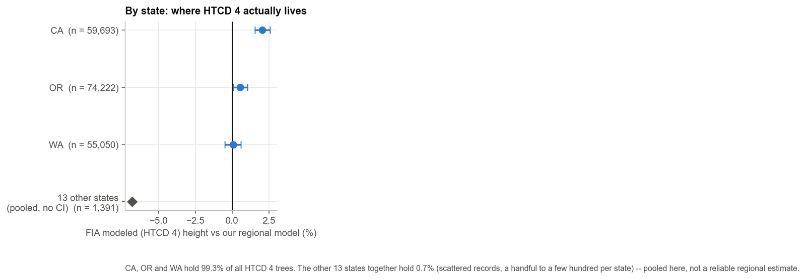
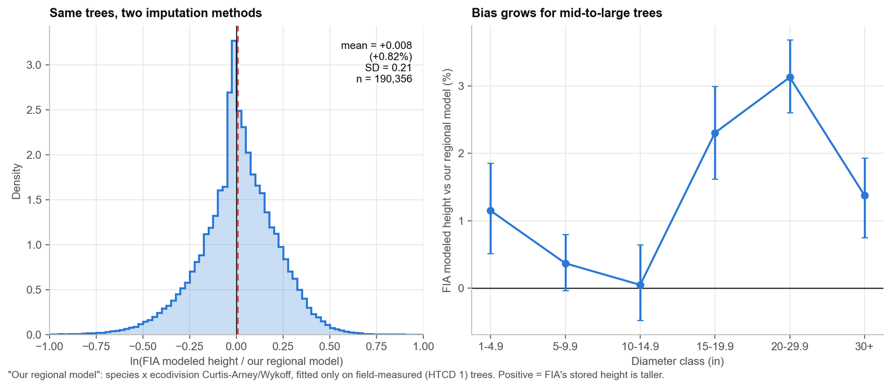
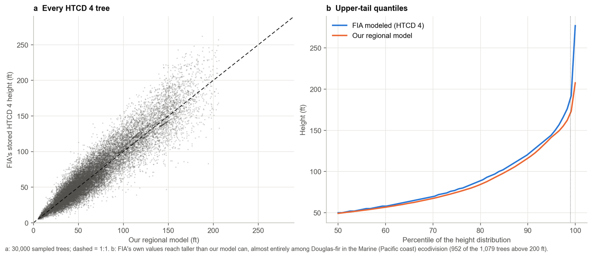
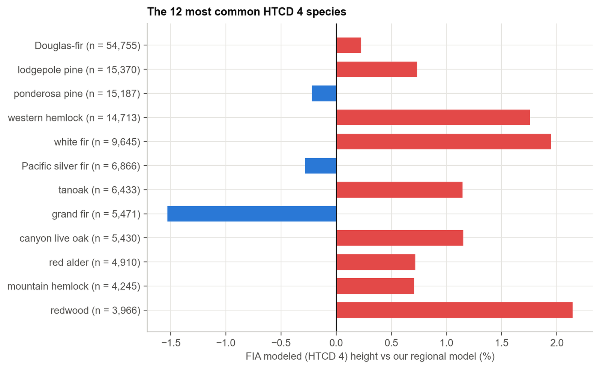

# How tall is that tree, take two: checking FIA's own height model against itself

*Understanding FIA data, part 2: height measurement*

In the [first post in this series](https://pratyush-dh.github.io/projects/blog/) I looked at how the FIA program's height method code, HTCD, splits tree heights into field measurements, crew visual reconstructions, and model output, and I checked the crews' visual reconstructions of broken-top trees (HTCD 2) against a height–diameter model trained only on measured trees. This post turns to the other non-measured category: **HTCD 4, "estimated with a model."** These are trees whose height was never taken in the field at all — FIA's own imputation stands in for it. HTCD 4 heights are almost entirely in three states: Oregon, California and Washington. I use the same regional model as before to check them, and the result flips the story from the first post on its head.

## The short version

- HTCD 4 heights ("estimated with a model") are 99.3% concentrated in Oregon, California and Washington. Everywhere else it's a handful of scattered records.
- On average, FIA's stored HTCD 4 height is about 0.8% above a regional model trained only on measured trees — close, but the gap grows to 2–3% for mid-to-large trees.
- The tallest disagreements are stark: FIA's values reach 277 ft, mine top out at 208 ft. Nearly all of the biggest gaps are Douglas-fir on the Pacific coast.
- I built an independent check: each tree's own earlier measured height, grown forward. Against that anchor, **FIA's modeled height is far closer than my regional model** — RMSE 4.9 ft vs 16.8 ft.
- The likely reason: FIA's procedure appears to use the tree's own measurement history (documented for this exact region in the literature); mine uses only today's diameter. That is a real, demonstrated weakness of diameter-only imputation, not a proof that FIA's black-box number is "right."

## A quick recap: what HTCD 4 means

Every FIA height carries a code, HTCD, saying how it was obtained: **1** field measured, **2** or **3** the crew's visual reconstruction of a broken-top tree, **4** "estimated with a model." The FIADB user guide gives no further detail — no equation, no citation, no description of what goes into it. The only documented account I could find in the previous post was for the Pacific Northwest specifically: Woo, Eskelson and Monleon (2020) state that unmeasured heights there are obtained by modeling the *height increment* between two visits with a Chapman–Richards height–diameter equation, and adding that increment to the tree's own **earlier measured height**. That detail turns out to matter a great deal below.

## Where HTCD 4 actually is

Across the current evaluation of every state, HTCD 4 accounts for 6.3% of live-tree records and 4.4% of the expanded tree population (from the first post). Almost none of it is spread evenly. Restricting to trees with **complete pipeline output** — a predicted height, current diameter, and a known ecodivision, 190,356 trees — **Oregon, California and Washington hold 99.3%** of them (74,222 / 59,693 / 55,050 trees). The other 13 states together hold 1,391 trees, a handful to a couple hundred each, and none of them individually forms a reliable sample.

## The experiment, again

I reused the exact regional model from [the first post](https://pratyush-dh.github.io/projects/blog/): Curtis–Arney and Wykoff height–diameter curves fit separately for each of 1,322 species-within-ecodivision groups, trained only on 11.8 million field-measured (HTCD 1) trees, with a fallback to a national per-species curve and then genus and all-species pooling for thin groups. That model already predicts a height for every HTCD 4 tree as part of the main study's pipeline (`new_ht` below); I compare it against the value FIA itself stored (`old_ht`).

This is a comparison of **two imputation methods** on trees whose true height neither one has ever measured — it is not automatically a validation. I bring in two things that do have some grounding in real measurements: the regional model's own error on measured trees on unseen plots (from the first post), and a fresh independent check described further down.

## Overall, they roughly agree — with a growing gap for bigger trees

FIA's stored HTCD 4 height is on average **0.82% above** the regional model (95% CI 0.52–1.11%, about 1.6 ft). The two distributions overlap heavily; the spread (SD of the log ratio, 0.21) is close to what the regional model shows on ordinary measured trees. But the average conceals a size trend: near zero for saplings and 10–15 inch trees, then +2.3% for 15–20 inch trees and +3.1% for 20–30 inch trees.

By ecodivision, most of this is explained by the regional model's own known regional bias (it isn't perfectly calibrated everywhere; see the first post). Subtracting that out, the Marine division along the Washington/Oregon coast (89,320 trees, the single largest group) shows essentially no excess disagreement once you account for the model's own bias there. Two smaller-but-still-substantial divisions do show a real gap: the Mediterranean climate division covering much of inland California and southern Oregon (55,662 trees, +2.1 percentage points) and a Temperate Desert division in the southern Cascades/Sierra transition (8,011 trees, +3.7 points).

## The tallest trees disagree the most

At the extremes, the two methods diverge sharply. FIA's stored heights run up to 277 ft; the regional model, bounded by what it has actually seen for a given diameter, tops out at 208 ft. Of the 1,079 HTCD 4 trees stored above 200 ft, the regional model only predicts 131 above that mark. 952 of those 1,079 are Douglas-fir in the coastal Marine division — home to some of the tallest trees on the continent. The ten single largest disagreements are all Douglas-fir: FIA stores 257–277 ft where the regional model predicts 166–206 ft for the same diameter.

Species other than Douglas-fir mostly track closely. Douglas-fir itself — the single most common HTCD 4 species, 29% of the total — shows almost no average bias (+0.2%, 82.6 vs 81.0 ft mean), which makes sense given it dominates the training data too; the disagreement is concentrated in its own extreme upper tail, not a general offset.

## A cleaner test: does either one track the tree's own growth?

Everything above compares two guesses against each other. FIADB has one thing neither guess directly used: for a remeasured tree, the height recorded at its **previous** visit, when it happened to be genuinely measured. If that earlier visit was a real field measurement of an intact tree, growing that height forward by a regionally appropriate growth rate gives an independent stand-in for the truth — never used to fit the regional model, and (as far as I can tell from the documented procedure) not literally the same as FIA's number either.

I pulled every HTCD 4 tree's `PREV_TRE_CN` link from the raw FIADB export and kept the 143,495 trees (75% of the 190,356) whose previous record was a genuine, intact field measurement. I grew that height forward using the median growth rate by diameter class computed from 388,912 real remeasurement pairs *within Oregon, California and Washington specifically* — not a national average — since Pacific coast conifers grow on their own schedule.

Against this anchor, the result reverses the pattern from the first post:

FIA's stored height has an RMSE of **4.9 ft** against this anchor; the regional model's RMSE is **16.8 ft** — more than three times larger. FIA is closer to the anchor for 84% of trees. The R² of FIA's value against the growth-projected height is 0.987; for the regional model it is 0.840. For the largest trees (30+ inches) the gap is extreme: 3.2 ft RMSE for FIA's number against 25.2 ft for the regional model.

**This needs a real caveat**, and it's an important one. An R² of 0.987 against (earlier measured height × growth) is exactly what you'd expect if FIA's own procedure is *built from* that same earlier height — which is precisely what Woo et al. (2020) document for this region: model the height increment, add it to the tree's last known height. FIADB even carries a dedicated field for this, `PREV_HT_FLD`, described as the previous total height "from the previous inventory (HTCD = 1, 2, or 3)" — the input is sitting right there in the schema. So this anchor test is not a fully independent judge of FIA's number; it's closer to an internal-consistency check that explains *why* FIA's value tracks so closely. For the regional model, which never sees any remeasurement history, the same test is fair and independent — and it exposes a real, mechanistic weakness: a model that only knows today's diameter cannot know that a particular tree has already grown taller than "typical" for that diameter, and the gap grows exactly where you'd expect, in the biggest trees.

## What this means

Put the two halves together and the conclusion is not "FIA's number is right" or "my model is right" — it's that **the two disagree for different, identifiable reasons**, and a purely diameter-based replacement (which is exactly what the main volume/biomass study used for every non-measured tree, HTCD 4 included) throws away information that a growth-based approach — which FIA's own HTCD 4 procedure appears to use, at least in this region — does not. That is a concrete mechanism behind a limitation the main study already flagged in the aggregate: DBH-only models understate the height of larger trees. This post shows one reason why, at the level of individual trees with a measurement history to check against.

It also suggests a fairly specific, actionable refinement: where a tree has a genuine earlier measurement, a growth-projection fallback would very likely outperform a purely cross-sectional diameter model — the data to do this already sits in FIADB (`PREV_HT_FLD`, `PREV_TRE_CN`). About three-quarters of HTCD 4 trees currently have this option available; a quarter (new plots, or trees whose previous cycle was itself unmeasured) would still need a diameter-based fallback.

## Where I might be wrong

1. Is my read of `PREV_HT_FLD`/`PREV_TRE_CN` as the mechanism behind HTCD 4's accuracy correct, or is this a coincidence of forests that simply don't change much between remeasurement cycles?
2. Is the Woo et al. (2020) PNW procedure actually used for the California divisions in this dataset, or do they use a different, undocumented approach that happens to produce similar behavior?
3. For the 25% of HTCD 4 trees without a usable earlier record, what does FIA's procedure fall back to?
4. Am I comparing like with like — does `old_ht` for a remeasured HTCD 4 tree ever get updated between cycles, or does it sometimes just carry forward the previous cycle's own HTCD 4 value?

I'd like to hear from people who work with or inside the program. As with the first post, this is an independent analysis, not an official FIA product, not peer reviewed, and I'd genuinely like to be corrected where I've misread something.

## Data and code

This post builds directly on [the first post in this series](https://pratyush-dh.github.io/projects/blog/) (HTCD 2, crew-reconstructed heights) — read that one first for the background on HTCD, the regional model, and its own code in `side_htcd2`. Scripts, result tables and the print-quality figures for this post are in [`side_htcd4`](https://github.com/pratyush-dh/projects/tree/main/blog/side_htcd4) alongside the rest of this series' code. Numbers here come from the main study's `targets_current.csv` (no database needed) and a fresh read-only pull from the FIADB SQLite export for the anchor test. The [next post](https://pratyush-dh.github.io/projects/blog/carbon-by-ecoregion/) in the series picks this thread back up, tracing how FIA-modeled heights connect to regional differences in carbon density.

## References

- Forest Inventory and Analysis Program. FIA Database user guide, volume: database description (version 9.2). USDA Forest Service.
- Woo, H., Eskelson, B.N.I., Monleon, V.J. 2020. Tree height increment models for national forest inventory data in the Pacific Northwest, USA. Forests 11(1): 2. [doi:10.3390/f11010002](https://doi.org/10.3390/f11010002).
- Westfall, J.A., Coulston, J.W., Gray, A.N., Shaw, J.D., Radtke, P.J., Walker, D.M., Weiskittel, A.R., et al. 2024. A national-scale tree volume, biomass, and carbon modeling system for the United States. USDA Forest Service, General Technical Report WO-104. [doi:10.2737/WO-GTR-104](https://doi.org/10.2737/WO-GTR-104).
