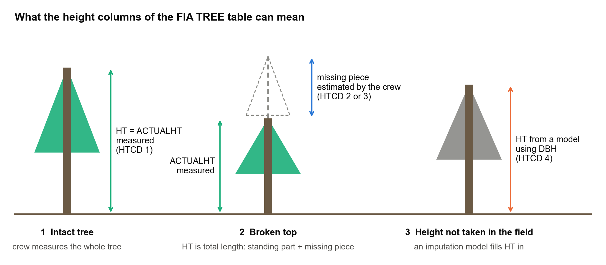
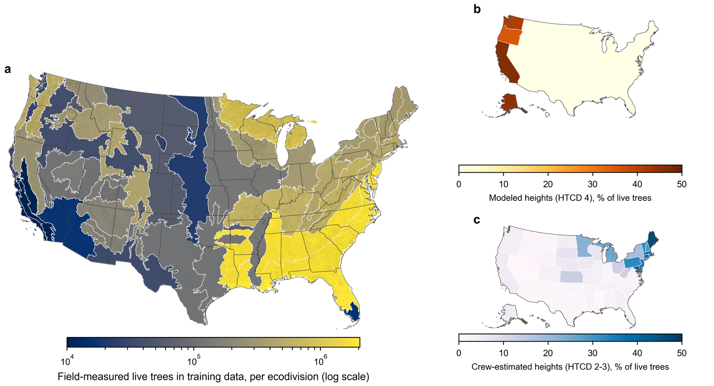
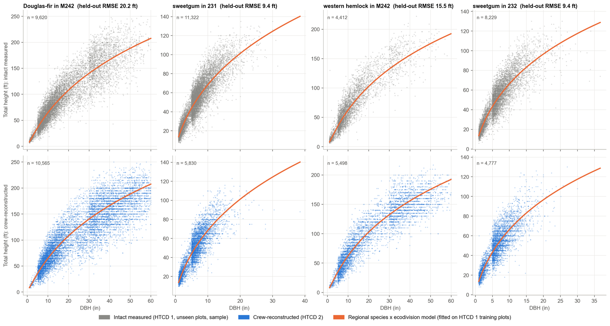
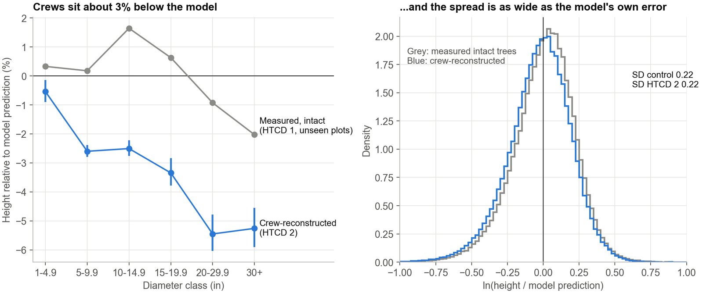
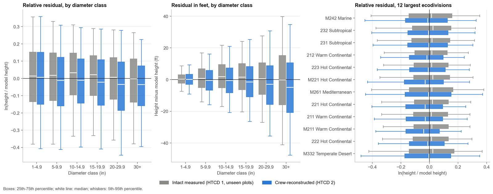
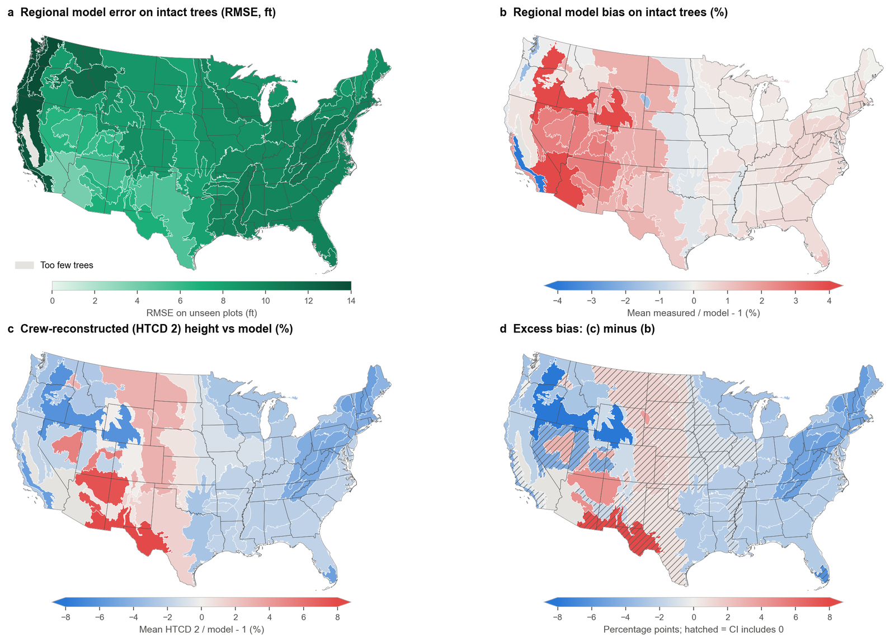
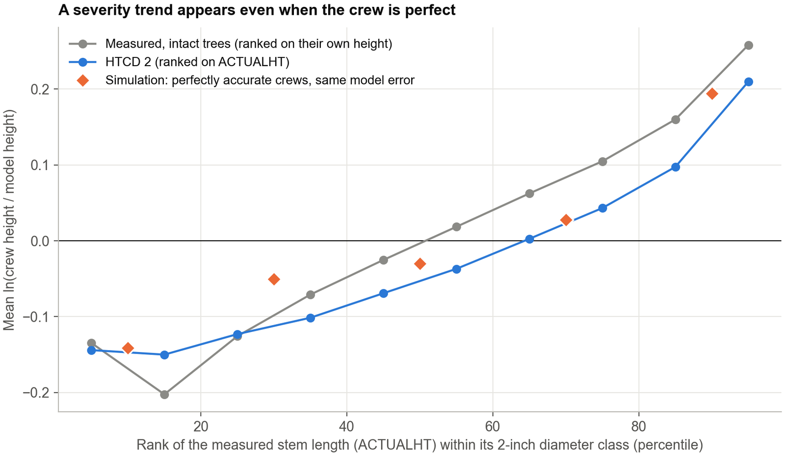
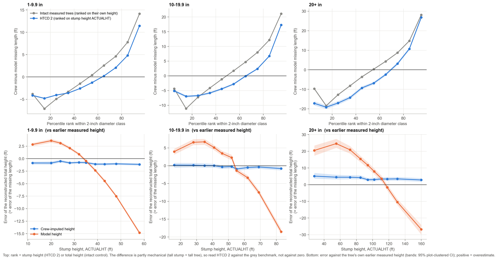
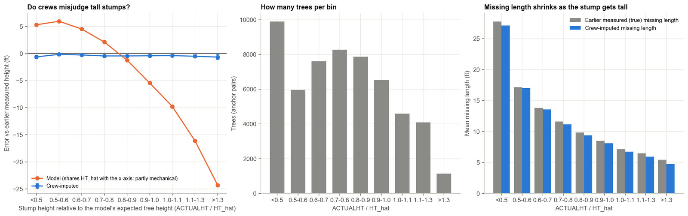

# How tall is that tree? What FIA's height code really tells you, and what happens when a model checks the crews

*Understanding FIA data, part: height measurement*

The Forest Inventory and Analysis (FIA) program of the U.S. Forest Service publishes its data through the FIA DataMart, and many people pull ready-made area estimates from EVALIDator (which also has an API). I am not talking about that here; if you are interested in extracting FIA data, start at the [FIA DataMart](https://research.fs.usda.gov/products/dataandtools/fia-datamart) and the [EVALIDator](https://apps.fs.usda.gov/fiadb-api/evalidator) pages.

What I want to talk about is what sits underneath those numbers. FIA reports plot-level measurements of trees, and turns them into plot-level and then area-level estimates of forest attributes using the tree status code (STATUSCD), expansion factors and an estimation framework that is mostly design-based, with model-assisted methods added where they help. All of that is done internally on FIA's database engines (the public database is distributed as SQLite, and the SQL logic can be copied if you need it). If you want to replicate area-level estimates for your own subset of the data, the R packages [**rFIA**](https://rfia.netlify.app/) and [**FIESTA**](https://github.com/USDAForestService/FIESTA) do that.

In this series I want to understand how FIA collects, stores and estimates from its data. Everything here is based on FIA's documentation and on what I have understood so far. That is one of the main reasons I am writing it: I would like people who know the program to tell me where I am wrong. This post is about **tree height**.

## The short version

- A height in the FIA tree table is not always a measurement. A code called **HTCD** says how it was obtained: measured, visually estimated, or computed by a model.
- In each state's latest inventory about 85% of live-tree records have a field-measured height. The rest are crew estimates or model values, and the model values sit almost entirely in four Pacific states.
- I trained height models **only on the measured trees** and used them to predict heights for trees whose tops are broken, comparing the prediction with what the crew wrote down.
- On average the crews sit about 3% below the model, but the spread between them is as large as the model's own error. Against each tree's *earlier measured* height, the crews do better than the model.
- A tempting plot (crew minus model, against stump height) shows a strong trend even when the crew is perfect. The trend is mostly mathematics, not behavior.
- A diameter-only model cannot be used to audit individual crew estimates: it flags them no better than chance.

## Height is not one number

Every tallied tree gets a diameter (DIA). Height is a bit more complicated. The FIADB user guide describes three related fields:

- **HT**: the total height of the tree, from the ground to the tip. The guide notes that "the total length of a tree is not always its actual length. If the main stem is broken, the actual length is measured or estimated and the missing piece is added to the actual length to estimate total length", by measuring the broken piece if it can be found on the ground, otherwise by estimating it.
- **ACTUALHT**: the height to the highest remaining part of the tree still attached to the stem. If ACTUALHT = HT the tree has no broken top; if ACTUALHT < HT it has a broken or missing top.
- **HTCD**, the height method code: **1** field measured (total and actual length); **2** total length visually estimated in the field, actual length measured; **3** total and actual lengths visually estimated; **4** estimated with a model.

So one column, HT, mixes three different kinds of values: measurements, crew judgements and model output. That matters as soon as you use HT for anything. Volume and biomass in FIA are computed with the National Scale Volume and Biomass (NSVB) system (Westfall et al. 2024), which takes species, diameter, total height, ecological division and stand origin as inputs. Whatever is in HT goes into the totals. And if you fit your own height–diameter or growth model to HT without looking at HTCD, part of your response variable is somebody else's model.

## How much of the database is not measured?

Across the whole database, 12.05 million of the 21.67 million live-tree records have a field-measured height (56%). In each state's latest evaluation the picture is very different:

| HTCD | Meaning | Live-tree records | Expanded trees | Aboveground biomass |
|---|---|---|---|---|
| 1 | Field measured | 84.9% | 85.6% | 86.8% |
| 2 | Total visually estimated, actual measured | 2.2% | 1.8% | 2.1% |
| 3 | Both visually estimated | 6.4% | 8.3% | 4.4% |
| 4 | Estimated with a model | 6.3% | 4.4% | 6.7% |
| missing | | 0.1% | 0.0% | 0.0% |

*Latest current-area evaluation of each of the 58 states and territories; my tabulation of FIADB 9.5.*

The distribution is very uneven. In 27 states fewer than 5% of the expanded tree population lacks a field-measured height; in 16 states it is more than 25%. And modeled heights (HTCD 4) are concentrated: 99.4% of those tree records are in Alaska, California, Oregon and Washington. Crew estimates (HTCD 2 and 3) are more common in the Northeast.

This is not a mystery: the FIADB user guide says only that HTCD 4 heights are "estimated with a model". The one description I could find of how such heights are produced is for the Pacific Northwest, where Woo, Eskelson and Monleon (2020) state that unmeasured heights are predicted by adding the difference between modeled tree heights at two measurements to the height observed at the first measurement, using a Chapman–Richards height–diameter equation at both times. I could not find a description for the other regions, and I do not want to claim there is none (see the last section).

## An experiment: use the measured trees as the yardstick

Trees with HTCD 1 have both a measured diameter and a measured height, so they can be used to learn the height–diameter relationship without any circularity. This is what I did, with the FIA database (version 9.5) in PostgreSQL:

1. Assigned every plot to an ecological division (Cleland et al. 2007).
2. Kept live trees with HTCD 1 (11.8 million trees, 520 thousand plots, 462 species) and split the *plots*, not the trees, 80/20 so that no plot contributes to both sides.
3. Fitted two classical forms, Curtis–Arney and Wykoff (from the growth-and-yield tradition), separately for each species (248 models) and for each species within each ecodivision (1,322 "regional" models), with a fallback from species-in-division to species to genus.
4. On the 20% of plots the models had never seen, the regional models have a root mean square error of about 10.3 ft (R² 0.83). That is the noise floor to keep in mind for everything below: a model that knows only species, region and diameter has a root-mean-square error of about 10 ft.

Then I applied those models to trees with **HTCD 2**, the broken-top trees whose total length was reconstructed by the crew (about 200 thousand trees with a broken top), predicted their total height from diameter, and compared it with the crew's number. These trees were never in the training data.

## Do crews and the model agree?

On average, yes, roughly. Relative to the intact measured trees on unseen plots, crew-reconstructed heights are **3.1% below the model** (95% interval 3.0–3.3%). The spread is the same for both groups (standard deviation of the log ratio 0.22), which says the disagreement is about as large as the model's own error on intact trees.

The gap is not the same everywhere. It is significantly different from zero in 21 of 37 ecodivisions and 39 of 48 states, almost always with crews *below* the model. It is largest among the well-sampled divisions, about 4 to 5 percentage points, in the eastern broadleaf, Appalachian and northern mixed-forest divisions, and it grows with tree size, reaching 6 to 12 points for 20–30 inch trees in the eastern divisions. The only division where crews are significantly *higher* than the model is the Arizona–New Mexico steppe (+4.6 points; about 1,000 trees).

There is one more layer. The model has its own regional bias on intact trees: it under-predicts the interior West by up to 2 to 3%, and its error is largest on the Pacific coast (15 to 16 ft) and smallest in the Southwest. So the fair comparison is against the intact trees in the same region, which is what panel (d) of the map shows.

## The broken piece itself

The natural quantity to compare is the length of the missing piece: what the crew added, HT − ACTUALHT, against what the model implies, HT_hat − ACTUALHT. Here is a small trap: the two differ by exactly HT − HT_hat, because ACTUALHT cancels. Comparing missing pieces is comparing total heights. It is fine to plot it, but it adds no new information about *why* they differ.

Against the missing length implied by the earlier measured height (bottom row), the crews overstate very short breaks (about 5 ft reported for a true 3 ft) and understate breaks longer than about 10 ft by roughly 12 to 19%. The model does the same and is worse for long breaks (about 25% short for a true 67 ft).

The model implies a *negative* missing length (it says the tree is shorter than its standing stump) for 13–15% of trees, which is a reminder of how loose a diameter-only prediction is for an individual tree.

### If the crew sees a tall stump, do they over- or underestimate?

That was my question, and the naive plot answers it wrongly. Plotting crew-minus-model missing length against stump height gives a steep upward trend: the taller the stump, the more the crew's piece exceeds the model's. It is tempting to read that as crews behaving differently on tall stumps.

But take *intact measured trees* and rank them by their own height in the same way, and you get almost the same curve. A tall stump means a tall tree, and a diameter-only model under-predicts tall trees, so the trend appears whatever the crew does. In a simulation with a perfectly accurate crew, using the same model error, the trend is just as strong.

To test crew behavior you need something that does not share noise with either estimate. For a subset of trees there is one: **the same tree's earlier measured, intact height** (from a previous inventory, HTCD 1, grown forward by the typical growth of intact trees). Against that reference, the crew's error is flat across stump heights, about 1 ft below the truth for trees under 10 inches, near zero at 10–20 inches and 3 to 5 ft above it beyond 20 inches. The model's error is not flat: it swings from +3 to +25 ft for short stumps to −15 to −27 ft for the tallest.

The same holds when stump height is expressed relative to what the model expects for that diameter: the crew's mean missing length stays within 0.4 to 0.7 ft of the measured one in every bin, from 27 ft for short stumps to 5 ft for the tallest.

So the answer to my question is: not detectably. The strong dependence on stump height is a property of the diameter-only model, not of the crews. (One trap I fell into while checking this: I first kept only pairs whose earlier height exceeded the stump by a foot, which selects on the earlier measurement's own noise and made crews look as if they underestimated tall stumps. Removing that filter removed the "effect". Selection filters can manufacture the pattern you are looking for.)

## Who is right? The earlier measurement

Against the earlier measured height, crews come out **better than the model**: typical error 0.19 in log units against 0.26 for the model, and 0.17 for a fresh measurement of intact trees compared with its own earlier measurement. The crew is closer than the model for about two out of three trees.

There is a caveat, and it is an important one. For 37% of HTCD 2 trees that have an earlier record, the height is **identical** to the earlier recorded height (for measured trees that happens 8% of the time), and that share rose from 20% before 2005 to 53% since 2020. Crew heights also cluster at multiples of 5 and 10 ft (44% of HTCD 2 heights are multiples of 5 ft, against 23% of measured ones). My reading, which I would like confirmed, is that at a remeasurement the crew can see the previous height, so an "independent visual reconstruction" is partly a carried-forward number. I excluded the identical cases from the comparison above, but values that were adjusted from the old one are still not independent. So this comparison shows the crews are consistent with the past; it cannot show they are independently accurate.

## Can a height model audit the crews?

I hoped a regional model could serve as an automatic quality-control check on field estimates. A rule flagging trees outside the 95% range of the model's error on intact trees flags 5.6% of HTCD 2 trees, against 5% expected by chance. As a detector of crew errors larger than 20% (relative to the earlier measurement) its area under the curve is 0.54, essentially a coin toss. A model that knows only species, region and diameter has an error (10 ft) that is bigger than the differences it is supposed to detect.

## Does any of this matter for volume and biomass?

At the national scale it is small, but it is not neutral. Replacing all non-measured heights by regional-model heights, recomputing NSVB and running FIA's post-stratified estimator changes national aboveground biomass by −0.12%:

| Scenario | Biomass change (95% CI) | Volume change |
|---|---|---|
| Regional height models | −0.117% (−0.143, −0.090) | −0.186% |
| National per-species models | −0.226% (−0.251, −0.200) | −0.319% |
| Regional, bias-corrected | +0.114% (+0.091, +0.138) | +0.144% |
| Replace only model heights (HTCD 4) | −0.127% | −0.180% |
| Replace only crew estimates (HTCD 2–3) | +0.010% | −0.005% |

*Change relative to the values stored in FIADB, national total of 35.3 billion short tons of aboveground biomass (54.7 tons per acre). Intervals are design-based.*

Three things stand out. Nearly all of the change comes from the model-derived heights (HTCD 4), not from the crew estimates. The *sign* of the national change depends on the model: a standard retransformation-bias (smearing) correction, needed because the models are fitted on the log scale, flips the result from a decrease to an increase. And when I pretend that trees with known, measured heights are unmeasured and impute them with the same models, all diameter-only models *understate* biomass, by 1.0 to 2.8%, and volume, by 1.5 to 3.9%, on those trees. The bias also grows with the inventory year: a model trained on all years under-predicts heights measured after 2020 by about 2.3 ft on average, against 0.1 ft before 2000.

None of this says the published totals are wrong. It says the height model is a choice, that the choice moves the answer by amounts comparable to the sampling error in some places, and that it should be documented.

## What I take from this

- **Filter on HTCD** before fitting any height or growth model to FIA heights. HTCD 4 heights are model output, and HTCD 2 and 3 are judgements.
- **Report the HTCD composition** of any estimate that depends on height, especially in California, Oregon, Washington and Alaska.
- **Be careful with ratio axes** (stump height divided by height) and with selection filters when studying crew behavior: both can create patterns from noise alone.
- **Do not use a diameter-only model as a quality-control audit** of individual field estimates. If auditing is the goal, it needs more predictors (site, crown, neighboring trees) or an independent reference.
- **Use earlier measurements** where they exist; they were the most informative reference I found. But check whether the crew could see them.
- **Expect drift.** A height model trained on many years will under-predict recent heights.

## Where I might be wrong, and what I would like to check with FIA

I would be glad to hear from people who work with or inside the program:

1. What produces HTCD 4 heights outside the Pacific Northwest, and what data was it fitted on?
2. Do data recorders show the previous height to the crew at a remeasurement? (It would explain the identical values.)
3. In 17% of the HTCD 2 trees ACTUALHT equals HT, which by the definition should mean no broken top. What is going on there?
4. A small share (0.6%) of trees coded HTCD 1 have ACTUALHT smaller than HT. Is that intended?
5. Is my reading of the earlier record (PREV_TRE_CN, HTCD 1, no broken top) as an intact height reference reasonable?

## Data and code

Everything here uses the public FIADB (version 9.5, from the [FIA DataMart](https://research.fs.usda.gov/products/dataandtools/fia-datamart)) and can be reproduced: [github.com/pratyush-dh/projects/tree/main/fia-height-htcd2](https://github.com/pratyush-dh/projects/tree/main/fia-height-htcd2). The full figure guide (what each figure shows and how to read it) is in the same folder. If you would rather explore FIA area estimates interactively, see my [US Forest Inventory Explorer](https://pratyush-dh.github.io/projects/fia-forest-stand-profile/). The analysis described in this post is in the `side_htcd2` folder; the volume and biomass part is described in a longer manuscript that is still being reviewed.

## References

- Forest Inventory and Analysis Program. FIA Database user guide, volume: database description (version 9.2). USDA Forest Service. Available from the [FIA DataMart](https://research.fs.usda.gov/products/dataandtools/fia-datamart).
- Westfall, J.A., Coulston, J.W., Gray, A.N., Shaw, J.D., Radtke, P.J., Walker, D.M., Weiskittel, A.R., et al. 2024. A national-scale tree volume, biomass, and carbon modeling system for the United States. USDA Forest Service, General Technical Report WO-104. [doi:10.2737/WO-GTR-104](https://doi.org/10.2737/WO-GTR-104).
- Woo, H., Eskelson, B.N.I., Monleon, V.J. 2020. Tree height increment models for national forest inventory data in the Pacific Northwest, USA. Forests 11(1): 2. [doi:10.3390/f11010002](https://doi.org/10.3390/f11010002).
- Cleland, D.T., Freeouf, J.A., Keys, J.E., et al. 2007. Ecological subregions: sections and subsections for the conterminous United States. USDA Forest Service General Technical Report WO-76D. [doi:10.2737/WO-GTR-76D](https://doi.org/10.2737/WO-GTR-76D).
- Curtis, R.O. 1967. Height-diameter and height-diameter-age equations for second-growth Douglas-fir. Forest Science 13(4): 365–375. [doi:10.1093/forestscience/13.4.365](https://doi.org/10.1093/forestscience/13.4.365).
- Arney, J.D. 1985. A modeling strategy for the growth projection of managed stands. Canadian Journal of Forest Research 15(3): 511–518. [doi:10.1139/x85-084](https://doi.org/10.1139/x85-084).
- Wykoff, W.R., Crookston, N.L., Stage, A.R. 1982. User's guide to the Stand Prognosis Model. USDA Forest Service General Technical Report INT-133. [doi:10.2737/INT-GTR-133](https://doi.org/10.2737/INT-GTR-133).
