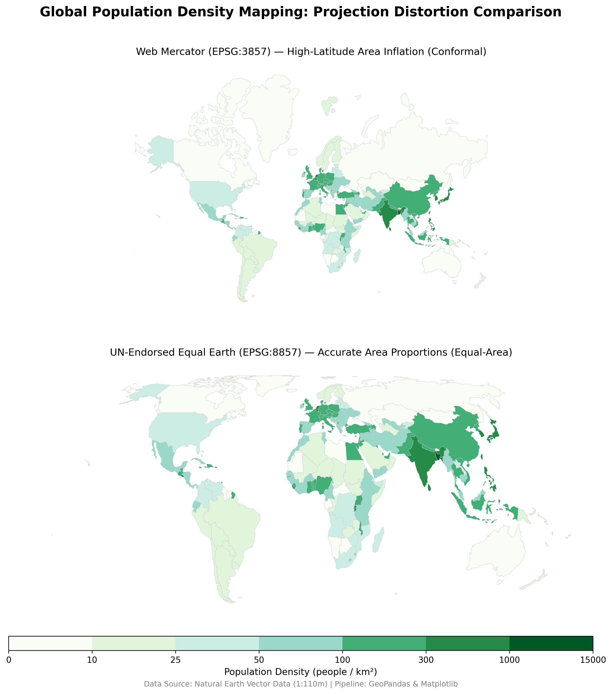

# Web Mercator vs. Equal Earth

An interactive world data explorer — population density, forest cover, CO₂ emissions,
and urbanization, each as an animated time-series choropleth — built around the standard
**Web Mercator (EPSG:3857)** projection and the UN-endorsed, equal-area
**Equal Earth (EPSG:8857)** projection.



## Live demo

Open `index.html` (via a local server, or GitHub Pages once enabled on this repo) to:

- **Pick a layer** — Population density, Forest cover, CO₂ emissions per capita, or
  Urbanization — each its own single-hue choropleth with its own color scale and legend.
- **Watch the active layer evolve on the map itself**: a year scrubber (with play/pause)
  recolors every country's fill for that year — not just a side chart, the map animates.
  Each layer has its own available year range (e.g. forest cover 1992–present, CO₂
  1970–present, population/urbanization 1960–present).
- **Morph the whole world map** between Web Mercator and Equal Earth with a single slider —
  countries visibly grow or shrink in place as the blend changes.
- **Search or click any country** to open a side-by-side comparison: the same country
  rendered under both projections at a shared scale, so you can see directly how much
  larger (or smaller) it's drawn under Mercator vs. its true equal-area size — plus its
  official stats, world rank, and a trend chart for whichever layer is active.
- Pan and zoom the map.

Only Natural Earth's 1:110m admin-0 boundaries are included, so a handful of very small
states/territories aren't present in the dataset, and a few non-UN-member territories
(Taiwan, Western Sahara, Northern Cyprus, Somaliland) don't have official World Bank
statistics for most layers — the app shows "Data unavailable" for those rather than
guessing.

## Data sources — and why

- **Boundaries**: [Natural Earth](https://www.naturalearthdata.com/) 1:110m admin-0
  countries. Used only for rendering; a simplified boundary's own area can differ from a
  country's surveyed area by a couple of percent, so it is never used as the source of
  truth for area.
- **Every statistic comes from [World Bank Open Data](https://data.worldbank.org/)**, one
  indicator per layer, each itself sourced from the relevant domain authority:

  | Layer | Indicator | Ultimate source |
  |---|---|---|
  | Population density | `SP.POP.TOTL` ÷ area | UN World Population Prospects, Population Division |
  | Forest cover | `AG.LND.FRST.ZS` | FAO (FAOSTAT) |
  | CO₂ emissions per capita | `EN.GHG.CO2.PC.CE.AR5` | EDGAR (JRC, European Commission) + IEA |
  | Urbanization | `SP.URB.TOTL.IN.ZS` | UN World Urbanization Prospects |

  World Bank's API doesn't require a key, unlike the UN Population Data Portal's own
  `/data` endpoints (now gated behind one) — this keeps the pipeline reproducible without
  secrets, while still resolving to the same authoritative underlying data.
  Worldometers.info was considered too, but it publishes no documented API, blocks
  non-browser automated requests, and its own "live" counters are extrapolations from the
  same UN data — so it wouldn't add authority, only fragility, to a pipeline meant to run
  unattended on a schedule.
  Note: `SP.URB.TOTL.IN.ZS` uses each country's own national definition of "urban," so a
  jump in a country's series can reflect an administrative reclassification (e.g. Nepal
  redesignating rural municipalities as urban circa 2017) rather than actual migration.
- **Distortion readout**: compares each country's rendered on-screen area share against
  its own geometry's equal-area (EPSG:8857) share of the whole rendered map — an internal,
  self-consistent baseline, kept separate from the *official* area shown in the stats panel.

## How it works

- **Client-side projection morphing**: `app.js` implements the Web Mercator and Equal
  Earth raw projection formulas directly (no extra projection library beyond D3's core
  `d3-geo`), then linearly blends the two point-by-point as the slider moves — a standard
  D3 "projection transition" technique.
- **Side-by-side comparison popup**: both projections are independently fit to the same
  viewport, so their scale/translate are directly comparable; the popup renders the
  selected country from each fitted projection at one shared zoom factor, so a visibly
  smaller shape in the Equal Earth panel means a real distortion, not a display artifact.
- **Trend charts**: a small reusable D3 line chart (with hover tooltip) renders both the
  per-country and global time series for whichever layer is active, baked into
  `data/world.json`.
- **Layer colors**: each layer is a single-hue sequential ramp (light→dark), with separate
  light/dark-mode steps generated in OKLCH and validated programmatically (monotonic
  lightness, ≥0.06 perceptual step size between bins, light-end contrast ≥2:1 against the
  surface) rather than eyeballed.

## Keeping the data current

`data/world.json` is a static file rebuilt by [`scripts/prepare_web_data.py`](scripts/prepare_web_data.py).
A scheduled GitHub Actions workflow ([`.github/workflows/update-data.yml`](.github/workflows/update-data.yml))
re-runs that script on the 1st of every month (and on manual dispatch) and commits the
refreshed file if the World Bank has published new figures. This keeps the deployed site
current without turning it into a live API call on every page view — GitHub Pages is
static hosting, so "auto-updating" here means "the build refreshes on a schedule," not
"every visitor triggers a live fetch." Enable GitHub Pages on this repo (Settings → Pages
→ deploy from branch, root) to serve the refreshed file automatically after each commit.

## Project layout

```text
equal-earth-projection-benchmark/
├── index.html                    # interactive web app (entry point)
├── style.css
├── app.js
├── data/
│   └── world.json                # generated by scripts/prepare_web_data.py
├── scripts/
│   └── prepare_web_data.py       # rebuilds data/world.json from Natural Earth + World Bank
├── .github/workflows/
│   └── update-data.yml           # monthly scheduled data refresh
├── main.py                       # standalone script: static side-by-side comparison plot
├── requirements.txt               # Python deps, for main.py / prepare_web_data.py only
└── projection_comparison_map.png
```

## Running locally

The web app fetches `data/world.json`, so it needs to be served over HTTP (opening
`index.html` directly via `file://` will fail to load the data due to browser CORS
restrictions on local file fetches):

```bash
git clone https://github.com/pratyush-dh/projects.git
cd projects/equal-earth-projection-benchmark
python -m http.server 8000
# open http://localhost:8000
```

Live demo: https://pratyush-dh.github.io/projects/equal-earth-projection-benchmark/

This project lives as a subfolder of the [`projects`](https://github.com/pratyush-dh/projects)
monorepo, alongside other standalone projects.

To regenerate `data/world.json` or the static comparison plot (`main.py`), install the
Python dependencies first:

```bash
pip install -r requirements.txt
python scripts/prepare_web_data.py   # rebuilds data/world.json (Natural Earth + World Bank)
python main.py                       # rebuilds projection_comparison_map.png
```

`main.py` also self-checks and installs its own dependencies on first run.

## Stack

- **Web app:** Vanilla JS, [D3.js](https://d3js.org/) (`d3-geo` for projections and path
  rendering, `d3-zoom` for pan/zoom, `d3-axis`/`d3-array` for the trend charts) — no build
  step.
- **Data pipeline:** Python, GeoPandas, PyPROJ, Shapely, `requests` (World Bank API client).
- **Automation:** GitHub Actions (scheduled data refresh).
