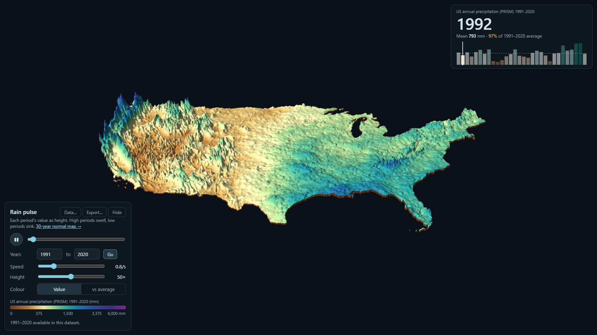

# Rainfall Relief & Pulse

US annual precipitation drawn as terrain: rainfall is the elevation. Two viewers share one
data pipeline.



**Live demo:** [Pulse (year by year)](https://pratyush-dh.github.io/projects/rainfall-relief/pulse.html)
· [30-year normal relief map](https://pratyush-dh.github.io/projects/rainfall-relief/)

## What it does

**Relief map** (`index.html`) shows the PRISM 1991-2020 annual precipitation normal (800 m) as
3D terrain in MapLibre GL, with isohyet contours in true millimetres.

- **Compare mode:** a second, linked 3D map shows real elevation (AWS Terrain Tiles) beside the
  rainfall relief. Both use one colour gradient, scaled min to max, and the same resolution and
  camera, so you can see where rainfall follows terrain and where it doesn't.
- Height slider capped at 100x, square-root or linear height scale, optional true-colour
  satellite imagery overlay, hover readouts in mm and metres.

**Rain pulse** (`pulse.html`) animates the 30 yearly PRISM grids as a breathing surface: wet years
swell, droughts sink, and the last year morphs back into the first.

- Colour by value, or by departure from the period average ("vs average").
- **Custom years:** pick any range. Ranges inside the loaded data apply instantly; other years are
  downloaded from PRISM and built on demand.
- **Bring your own data:** upload one raster per year (GeoTIFF, BIL, ASC, IMG, zips fine; the year
  in the file name) or one multi-band GeoTIFF. Any projection is reprojected, mismatched grids are
  resampled onto the first, and the result loads straight into the viewer. The Data dialog lists
  places to find datasets (PRISM, CHIRPS, TerraClimate, ERA5-Land, nClimGrid, GPM IMERG).
- **Export:** one PNG per year (as a ZIP) and an animated GIF, each composed with a title, the year,
  the area mean, a legend, a layer description and the data source.

The hosted demo is static, so it shows the built-in 1991-2020 data and can export. Building other
years and uploading your own data needs the local server below.

## Run locally

```bash
pip install -r requirements.txt
python serve.py                 # http://localhost:8000/pulse.html
```

`serve.py` is a drop-in for `python -m http.server` that adds the build and upload endpoints. It
binds to 127.0.0.1 only; uploaded files stay on your machine and are deleted once processed.

To rebuild the data yourself:

```bash
python build_rain_years.py                      # pulse data, 1991-2020 (downloads PRISM 4 km annual grids)
python build_rain_years.py --years 2000 2023    # another range

# relief-map tiles: download the PRISM 1991-2020 annual precipitation normal (800 m) from
# https://prism.oregonstate.edu/normals/ first
python build_rain_relief.py --src prism_ppt_us_30s_2020_avg_30y/prism_ppt_us_30s_2020_avg_30y.tif --zmax 7
```

On some Windows machines a PostgreSQL/PostGIS install sets `PROJ_LIB` and breaks rasterio's CRS
lookups. `rain_engine.py` points it at rasterio's own PROJ data automatically; `build_rain_relief.py`
does not, so set `PROJ_LIB`/`PROJ_DATA` to rasterio's `proj_data` folder if you hit that error.

## Files

| File | Purpose |
|---|---|
| `pulse.html` | Pulse viewer (three.js): year range, data dialog, export |
| `index.html` | Relief map and compare mode (MapLibre GL) |
| `rain_engine.py` | Rasters to a packed dataset: reprojection, resampling, decimation, PRISM download |
| `serve.py` | Local static server plus the job API behind uploads and PRISM builds |
| `build_rain_years.py` | CLI wrapper for the pulse dataset |
| `build_rain_relief.py` | Builds the relief-map tiles (terrain-RGB, colour, isohyets) |
| `pulse_data/` | Built-in 1991-2020 dataset (uint16 grids plus metadata) |
| `rain_relief_out/` | Prebuilt relief-map tiles (z3-7) |

## Data and credits

- Precipitation: PRISM Climate Group, Oregon State University, https://prism.oregonstate.edu
  (1991-2020 normals at 800 m; annual grids at 4 km).
- Elevation (compare mode): Mapzen / AWS Terrain Tiles.
- Imagery overlay: Sentinel-2 cloudless by EOX, CC BY-NC-SA 4.0 (non-commercial use).
- Libraries: MapLibre GL JS, three.js, gifenc.

## Limits worth knowing

- Pulse data is block-averaged to roughly 8 km so 30 years fit in the browser; the relief map keeps
  the 800 m source. Uploads are coarsened the same way when large.
- Heights are exaggerated and square-root scaled by default, so shapes show pattern, not true
  proportions. Contours and readouts carry the true values.
- Ocean and no-data cells are flat, so coasts of wet regions read as cliffs. That is the data, not
  an artifact.
- GIF exports use 256 colours per frame, so gradients look a little coarser than the PNGs.
- Not yet tested on a real non-US dataset (CHIRPS, ERA5); the engine was tested on a synthetic
  projected raster with negative values.
